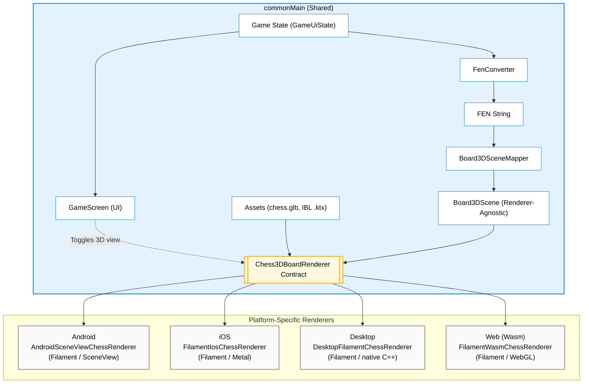

# game

Compose Multiplatform chess app with full support for all standard chess rules and a 3D view mode, targeting:

- Android
- Desktop (JVM): Linux and macOS
- Web (Wasm)
- iOS

## Setup

For the desktop target on Linux and macOS, **JDK 26 is recommended**. The desktop 3D renderer uses a native C++ Filament bridge; after a clean checkout run `tools/fetch_filament_desktop.sh` to fetch the gitignored Filament desktop payload before desktop builds.

For the desktop target on Linux, install stockfish first:

```bash
sudo apt install stockfish  # For Ubuntu/Debian
sudo pacman -S stockfish    # For Arch
sudo dnf install stockfish  # For Fedora
```

For the desktop target on macOS:
```bash
brew install stockfish
```

### iOS Setup

macOS, Xcode 16+, and a working project JDK are required.
1. `tools/fetch_filament_ios.sh`
2. `open iosApp/iosApp.xcodeproj`
3. Run the `iosApp` scheme

The Stockfish engine is bundled automatically. The Filament iOS xcframeworks are fetched separately
because they are large generated dependencies and are intentionally gitignored.

## Architecture & Features

### Modules

The project is split into focused Gradle modules:

- **`:chess-core`** — the Compose-free, platform-agnostic chess engine core (all game rules,
  FEN/UCI/SAN/PGN converters, `GameViewModel`, and the pure-Kotlin 3D-board math/scene mapping). It
  has **no Compose, no russhwolf/Settings, no `java.lang.Process`**. Targets: Android, JVM (desktop),
  iOS (arm64/simulator), **JS (IR)**, and Wasm. Published to GitHub Packages as
  **`io.github.ber4444:chess-core`** (tag-driven: push `chess-core-v*` → `publish-chess-core.yml`
  publishes that version). Consumed by `:app` (below) and by the
  [React Native port](https://github.com/ber4444/react-native-kotlin-multiplatform-chess), so there
  is **no duplicated Kotlin** across the two repos — bump `chessCoreVersion` to pick up core changes.
  Also home to the [perft verification rig](docs/perft.md) — the move generator is proven correct
  against arithmetic ground truth (canonical perft counts + Stockfish cross-check).
- **`:app`** — the Compose Multiplatform app: all UI screens, platform glue, Stockfish bridges, and
  the 3D renderers. Depends on `:chess-core` via `api(project(":chess-core"))`.
- **`:androidApp`** — thin Android application wrapper (manifest, launcher icons) that depends on `:app`.
- **`:onDeviceAi`** — on-device AI orchestration (move coach, rules Q&A, opening explainer, route
  policy) in `commonMain`, with platform-specific LLM runtimes injected (Cactus on Android, Foundation
  Models on iOS, deterministic fallback on desktop/wasm/JS). Published to GitHub Packages as
  **`io.github.ber4444:onDeviceAi`** (tag-driven: push `on-device-ai-v*` → `publish-on-device-ai.yml`
  publishes both `:onDeviceAi` and `:coachApi` together). Consumed by `:app` and by the
  [React Native port](https://github.com/ber4444/react-native-kotlin-multiplatform-chess).
- **`:coachApi`** — serialization-only KMP wire models (`OpeningExplainRequest`/`Response`, etc.)
  shared by `:onDeviceAi` and the opening explainer service. Published as
  **`io.github.ber4444:coachApi`** because `:onDeviceAi` exposes its types in public signatures
  (OpeningExplainer returns `OpeningExplainResponse`), so consumers need it transitively.
- **`:server`** — JVM Ktor opening-explainer service with pgvector retrieval and deterministic
  composition; the optional provider composer always validates and falls back locally.
- **`:evals`** — rule-based grounding and length regression suite for AI coach routes.
- **`:perft-mcp`** — a thin stdio [MCP server](docs/perft.md#the-mcp-server-perft-mcp) exposing the
  perft rig as three tools (`run_perft_gate`, `stockfish_divide`, `read_divergence`) for agent-driven
  verification loops. JVM-only; no dependency on `:app` or `:chess-core` (it shells out to gradle +
  stockfish as an adapter, not an engine).

The core↔app boundary is enforced by three seams (don't re-couple them):
  - `Piece` has no `asset` field; `:app` resolves drawables via `PieceAssets.asset()`.
  - Core types have no `@Immutable` (Compose stability hints); `:app`'s compiler re-infers stability.
  - `GameViewModel` takes a `GameSnapshotSink` (core interface), not the russhwolf `CurrentGameStore`;
    `:app` adapts via `CurrentGameStore.asSnapshotSink()`.

### 3D Rendering Pipeline



- **Full Chess Rules:** The application covers all standard chess rules and includes an explicit draw-by-agreement flow where the Stockfish engine evaluates whether to accept or decline draw offers.
- **Game Lifecycle & Persistence:** The in-progress game is auto-saved on every move and restored on next launch (board, turn, move list). On game end, the user can **Save game** (to a persisted Game History) and **Share PGN** (platform share sheet / file dialog / download). PGN export is full Standard Algebraic Notation with the Seven Tag Roster; paste a saved PGN into lichess.org "Import game" to validate. A **History** screen lists saved games with a detail view and delete.
- **Engine Difficulty:** A persisted Easy / Medium / Hard / Max setting (in **Settings**) weakens or strengthens Stockfish play via the UCI `Skill Level` option and a per-move think-time budget. Applies to the Stockfish engine on every platform.
- **Settings & Navigation:** A minimal multiplatform navigation host (`AppRoot`) switches between the game, **History**, **Settings**, and **Rules** screens, with a persisted 3D-board toggle (default on) and the engine-difficulty selector in Settings.
- **On-device AI Move Coach:** A debug-gated (`ApplicationInfo.FLAG_DEBUGGABLE`) Compose panel (`MoveCoachPanel`) that surfaces a natural-language explanation of Black's move after it animates. Wired by `GameViewModel.triggerCoach(...)` — cancellable, never blocks the move, skipped if the move ends the game. Backed by a shared KMP module `:onDeviceAi` holding the routing policy (`AiRoutePolicies.moveCoachOffline`), prompt builder, and deterministic fallback in `commonMain`; platform runtimes are injected at the entry points. See [On-Device AI Architecture](docs/on-device-ai-architecture.md) for details on the prompt and routing policy.
  - **Android backend:** **Cactus (`com.cactuscompute:cactus:1.4.1-beta`)** — llama.cpp CPU runtime. The `gemma3-270m` model (~200 MB GGUF) is downloaded from Hugging Face by Cactus on first launch into `filesDir` (debug APK ~258 MB; no model bundled in the APK). `AndroidManifest.xml` declares `INTERNET` so Cactus can fetch the model. Cold start ~1–2 s. Replaced the earlier LiteRT-LM path (7–9 s cold init, streaming crash, no resolvable Maven coordinate) and the ML Kit Prompt API path (narrow AICore device support); `MoveCoachModelAsset.kt` and `AndroidCoachWiring` were removed in the migration. See `docs/benchmarks/on-device-ai/android-delivery-decision.md`.
  - **iOS backend:** **Foundation Models** (Apple Intelligence) via `FoundationMoveCoachBridge` registered into `FoundationModelsBridgeRegistry` from `iOSApp.swift`. Falls back to rule-based text when Apple Intelligence is unavailable. iOS has **not** been migrated to Cactus yet — it stays on Foundation Models, though the `:onDeviceAi` KMP module makes that swap feasible later.
  - **Desktop backend:** **LiteRT-LM** (`com.google.ai.edge.litertlm:litertlm-jvm`, Google AI Edge) — the Kotlin/JVM API over LiteRT-LM, with native libs bundled inside the jar (linux-x86_64 / linux-aarch64 / darwin-aarch64 / win-x86_64; **no Intel Mac** — those hosts fall back). The Qwen3-0.6B-int4 model (~347 MB `.litertlm`) is downloaded from Hugging Face on first launch and cached under `~/.chess-coach-models/`. Gated behind `CHESS_ENABLE_COACH=1` (env var) — without it the coach panel stays hidden (the previous default). See `docs/benchmarks/on-device-ai/desktop-wasm-litert-lm.md`.
  - **Wasm backend:** **LiteRT-LM for Web** (`@litert-lm/core`, loaded from the jsdelivr CDN at runtime) running in a module Web Worker so inference is off the main thread. Uses `gemma-4-E2B-it-web.litertlm` (~2 GB, the only model `@litert-lm/core` officially documents for web). Requires **WebGPU** (Chrome/Edge); on Firefox/Safari the generator reports unavailable and the orchestrator falls back to the deterministic `MoveCoachFallback`. Gated behind `?coach=1` on the page URL.
  - **JS target** (`js(IR){nodejs()}`): still `UnsupportedTextGenerator` — the React Native port has no WebGPU/workers.
- **Opening Explainer (cloud route):** The one AI feature that is *allowed* to leave the device. When a game ends, a post-game panel (`OpeningExplainerPanel`) fetches a short, grounded explanation of the opening from a small Ktor + Postgres + pgvector service (`:server`). It is the only policy with `allowCloud = true` (`AiRoutePolicies.openingExplainer`, `PUBLIC_OR_SYNTHETIC`, 0.2¢ ceiling). The cloud client is injected from `:app`; if the base URL is unset, the network is down, or the service returns non-2xx, the panel shows a deterministic offline-guidance message instead. The move coach's `LOCAL_ONLY` policy can never reach this route — an exhaustive 60-context decider test proves it. See [Opening explainer service](#opening-explainer-service) below for deployment.
- **Rules Q&A (on-device):** A `LOCAL_ONLY` feature distinct from both the move coach (no retrieval) and the opening explainer (cloud retrieval). A **Rules** screen lets the player ask a natural-language chess-rules question; retrieval and generation stay entirely on-device. The corpus is a bundled 30-passage FIDE/Wikibooks adaptation (`onDeviceAi/src/commonMain/resources/rulesCorpus/passages.tsv`) looked up via BM25 (`BundledRuleLookupTool`). iOS uses a native Foundation Models `Tool` conformance with `NLEmbedding` query-time ranking; Android uses structured-output prompting (the model emits a `{"tool":"lookup_rule","query":"…"}` envelope, Kotlin does the real lookup, then a second generation turn cites the passage). An answer that doesn't cite a retrieved passage ID is rejected and falls back to a static rules summary. See `docs/benchmarks/on-device-ai/rules-qa-retrieval-decision.md` for why BM25 was chosen over a bundled embedding model.
- **3D Board View:** The app features a playable 3D board with shared camera, tap-to-move, ray picking, and move animation logic. Desktop, iOS, and web share `FilamentEncodedChessRenderer` for FEN-to-scene, camera, selection, and transition state; their platform peers only own the Filament surface. Android uses Filament through SceneView (the visual reference); iOS uses **Metal-native Filament** through a Swift/Obj-C++ `CAMetalLayer` bridge; desktop uses **native C++ Filament** with a headless swap chain and RGBA readback into Compose; web uses **Filament (Wasm)** loading the same `chess.glb` Android uses. See `docs/plans/web-graphics-spike-result.md` and `docs/plans/ios-filament-spike-result.md` for the spike verdicts.
- **Stockfish Engine Integrations:**
  - **Android:** Pinned to Stockfish 17, as the Stockfish 18 binary exceeds GitHub's 100 MB file limit.
  - **Desktop:** Relies on system-installed binaries (e.g., via `apt` or `brew`).
  - **Web (Wasm):** Uses a lightweight `stockfish-18-lite-single.js` running in a Web Worker.
  - **iOS:** Wraps `ChessKitEngine` using an async-sync bridge and utilizes NNUE via `EvalFileSmall`.
- **Perft Verification Rig:** The move generator is proven correct against arithmetic ground truth — [canonical perft counts](https://www.chessprogramming.org/Perft_Results) for six standard positions, plus a Stockfish `go perft` divide-diff cross-check over a seeded random walk of arbitrary midgame/endgame positions. The rig runs in CI on every PR and nightly (deep tier). A pure top-level `applyMove` (extracted from `GameViewModel.deriveNewGameState`) makes the generator testable to perft depth without ViewModel side effects. An optional MCP server (`:perft-mcp`) exposes the rig as tools for agent-driven verification loops. See **[docs/perft.md](docs/perft.md)** for the full walkthrough.

## Project layout

- `chess-core/src/commonMain` the Compose-free chess engine core (rules, FEN/UCI/SAN/PGN, `GameViewModel`, board3d math) — published as `io.github.ber4444:chess-core`
- `chess-core/src/commonTest` + `chess-core/src/desktopTest` the [perft verification rig](docs/perft.md) (canonical gate + Stockfish oracle + deep tier)
- `app/src/commonMain` the Compose UI, persistence, share, and 3D renderer glue (depends on `:chess-core`)
- `app/src/androidMain` Android-specific shared implementation and Stockfish integration
- `androidApp/src/main` Android application manifest that depends on the shared KMP module
- `app/src/desktopMain` desktop launcher
- `app/src/wasmJsMain` web launcher
- `app/src/iosMain` shared iOS implementation
- `iosApp/` Xcode project and Swift adapter
- `coachApi/src/commonMain` serialization-only wire models — published as `io.github.ber4444:coachApi`
- `server/` JVM Ktor opening-explainer service (Postgres + pgvector retrieval, ONNX MiniLM embeddings, `:server:seed` corpus loader)
- `evals/` rule-based eval harness and golden-set scorecard for all AI coach routes
- `onDeviceAi/src/commonMain/resources/rulesCorpus/` the bundled offline FIDE/Wikibooks rules corpus (30 passages, BM25-lookupable)
- `onDeviceAi/src/` published as `io.github.ber4444:onDeviceAi` — the on-device AI orchestration consumed by `:app` and the RN port
- `perft-mcp/` the [perft MCP server](docs/perft.md#the-mcp-server-perft-mcp) — a thin stdio adapter exposing the rig as agent tools

Third-party asset and dependency notices live in [THIRD_PARTY_NOTICES.md](THIRD_PARTY_NOTICES.md).

## `:chess-core` — public API & dependency boundary

`:chess-core` is the platform-agnostic chess engine core. It is consumed by `:app` for the UI/platform glue, and published as `io.github.ber4444:chess-core` for the React Native repository.

- **Dependency split (`api` vs `implementation`)**: `kotlinx-coroutines-core` is an `api` dependency because `StateFlow` is exposed on `GameViewModel`. `kermit` and `kotlinx-serialization-json` are `implementation` details.
- **Public API surface**: The core intentionally exposes engine entry points (`GameViewModel`, `ChessEngine`), state types (`GameUiState`, `WinState`), the piece model, FEN/PGN converters, the persistence seam (`GameSnapshotSink`), and `board3d` scene types.
- **Internal implementation**: Raw move-generation rules, draw-condition internals, and 3D math helpers are deliberately marked `internal` and are completely unreachable by consumers. If a symbol isn't listed above, assume it is internal.

## `:onDeviceAi` & `:coachApi` — public API & dependency boundary

`:onDeviceAi` is the on-device AI orchestration module (move coach, rules Q&A, opening explainer,
route policy). It is consumed by `:app` for the chess UI and published as
`io.github.ber4444:onDeviceAi` for the React Native repository. `:coachApi` is its serialization-only
wire-model dependency, published as `io.github.ber4444:coachApi`.

- **Dependency split (`api` vs `implementation`)**: `:coachApi` is an `api` dependency because
  `OpeningExplainer.kt` exposes `OpeningExplainRequest`/`OpeningExplainResponse` in public signatures
  (constructor params, return types, sealed-result properties). `kermit` and `kotlinx-coroutines-core`
  are `implementation` details. Consumers of `:onDeviceAi` transitively get `:coachApi` on their
  compile classpath.
- **Public API surface**: `AiCoachOrchestrator` / `DefaultAiCoachOrchestrator`, `GameSummaryOrchestrator`,
  `RulesQa` orchestrator + `RulesQaResult`/`RulesQaModelOutput`, `OpeningExplainer` +
  `OpeningExplainerResult`, `RuleLookupTool` / `BundledRuleLookupTool`, `AiRoutePolicy` /
  `AiRoutePolicies`, `OnDeviceTextGenerator` / `OnDeviceTextGeneratorFactory`, the `MoveCoach*` /
  `GameSummary*` model + result sealed types.
- **Platform actuals**: `commonMain` declares `expect` factories for the on-device text generator,
  `defaultNowMs()`, and the rules-QA answerer. Each platform provides an `actual`: Android = Cactus
  (llama.cpp), iOS = Foundation Models, desktop = LiteRT-LM (`litertlm-jvm`, gated by
  `CHESS_ENABLE_COACH=1`), wasm = LiteRT-LM for Web (`@litert-lm/core`, gated by `?coach=1`,
  WebGPU-only), JS = deterministic no-op fallback (`UnsupportedTextGenerator` / `null`). The RN
  consumer's JS target gets the fallback — no on-device LLM on JS, so the orchestrators degrade to
  rule-based text.
- **Publishing**: tag `on-device-ai-v*` triggers `publish-on-device-ai.yml`, which publishes both
  artifacts at the same version. Both target Android, JVM (desktop), iOS (arm64/simulator), JS (IR),
  and Wasm.

```bash
git tag -a on-device-ai-v0.1.0 -m "Publish io.github.ber4444:onDeviceAi:0.1.0 + coachApi"
git push origin on-device-ai-v0.1.0
```

## Benchmarking

To measure performance metrics of the on-device AI integration (init times, tokens/sec, memory), the project includes a dedicated benchmarking harness for both Android and iOS targets. 
- [On-Device Benchmark Harness](docs/benchmark-harness.md) — Execution instructions and architecture details for the harness.
- [Benchmark Schema](docs/benchmarks/on-device-ai/move-coach-benchmark-schema.md) — The schema and target latency thresholds for the metrics.

## Useful Gradle tasks

- `./gradlew :chess-core:check` runs the chess-core test suite across all targets (desktop + iOS sim + JS)
- `./gradlew :chess-core:jsNodeTest` runs just the Kotlin/JS tests (the target the React Native port consumes)
- `./gradlew test` runs shared unit tests
- `./gradlew :androidApp:assembleDebug :androidApp:installDebug` builds and installs the Android app
- `./gradlew :app:run` launches the desktop app
- `CHESS_ENABLE_COACH=1 ./gradlew :app:run` launches the desktop app **with the on-device Move Coach enabled** (downloads the Qwen3-0.6B model, ~347 MB, on first launch; cached at `~/.chess-coach-models/`). Without the env var the coach panel stays hidden — mirrors Android's `FLAG_DEBUGGABLE` gate.
- `./gradlew :app:wasmJsBrowserDevelopmentRun` starts the web target
- `./gradlew :app:wasmJsBrowserDevelopmentRun` then open the page with **`?coach=1`** appended to the URL to enable the on-device Move Coach (Chrome/Edge only — requires WebGPU; loads `gemma-4-E2B-it-web.litertlm` ~2 GB from Hugging Face). Without `?coach=1` the coach panel stays hidden.
- `./gradlew :app:wasmJsBrowserDevelopmentWebpack` builds the web development bundle without starting the dev server
- `./gradlew :app:connectedAndroidDeviceTest` runs Android UI tests
- `./gradlew :app:iosSimulatorArm64Test` runs iOS Compose UI tests
- `./gradlew :app:desktopTest --tests "*board3d*"` runs the 3D desktop tests (DesktopRendererSmokeTest writes `build/chess3d-*.png` to eyeball the render)
- `./gradlew :chess-core:publishToMavenLocal` publishes `io.github.ber4444:chess-core` to the local Maven cache (for local cross-repo iteration)
- `./gradlew :coachApi:build` builds and tests the serialization-only wire-model module
- `./gradlew :coachApi:publishToMavenLocal :onDeviceAi:publishToMavenLocal` publishes both AI artifacts to the local Maven cache (for local cross-repo iteration with the RN port)
- `./gradlew :server:test` runs the opening-explainer service tests (Testcontainers Postgres; skips without Docker)
- `./gradlew :server:seed` seeds the opening corpus into a Postgres database (needs `DATABASE_URL` + embedding model paths)
- `./gradlew :evals:run` runs the rule-based eval harness and regenerates `evals/scorecard.md` (fails on grounding regression)
- `./gradlew :chess-core:desktopTest --tests "*Perft*"` runs the [perft gate](docs/perft.md) (canonical counts + Stockfish cross-check)
- `./gradlew :chess-core:desktopTest --tests "*PerftDeepTest*" -Dperft.deep=true` runs the deep perft tier (nightly-only depths; slow)
- `./gradlew :perft-mcp:test :perft-mcp:installDist` builds the [perft MCP server](docs/perft.md#the-mcp-server-perft-mcp)
- `tools/ios_3d_screenshot.sh` captures the real iOS 3D board from a booted simulator

### Opening explainer service

The opening explainer is the one AI feature allowed to leave the device. A finished game sends the
opening moves (FEN + first 20 SAN plies + ECO) to a small cloud service, which retrieves relevant
opening passages from a vector corpus and composes a 2–3 sentence explanation. The app never sends
anything that identifies a user — only public/synthetic chess position data.

The service contract is [server/openapi.yaml](server/openapi.yaml) — the source of truth for the two
endpoints (`POST /v1/openings/explain` and `GET /health`). A swagger-request-validator contract test
in `:server:test` validates real responses against it.

**Architecture** — two endpoints, one Postgres, no queues or caching tiers:

- **Retrieval** — `all-MiniLM-L6-v2` (ONNX Runtime, 384-dim) embeds the query (ECO name + opening
  moves); `ORDER BY embedding <=> $1 LIMIT 4` pulls the four closest passages from a `passages`
  table with a pgvector `vector(384)` column. The embedder is behind an `Embedder` interface with a
  deterministic fake, so `:server:test` never downloads a model.
- **Composition** — `TemplateComposer` (default, deterministic, zero model cost) stitches the
  retrieved passages into grounded sentences. `LlmComposer` calls an OpenAI-compatible provider API
  only when `COACH_LLM_API_KEY` is set; it validates the LLM output with the same grounding rules as
  the on-device coach (forbidden phrases, max length, citation + token overlap) and falls back to
  `TemplateComposer` if validation fails — unvalidated prose is never returned.
- **Corpus** — `server/corpus/` holds the five ECO openings TSVs from `lichess-org/chess-openings`
  (CC0) plus curated concept notes. The `:server:seed` task (`SeedMain`) chunks, embeds, and upserts
  them into Postgres.

**Runtime configuration** is read only from environment variables (no secrets are committed):

| Variable | Required | Purpose |
|---|---|---|
| `DATABASE_URL` | yes | Postgres connection string (Fly Postgres, Neon, etc.) with pgvector enabled |
| `COACH_EMBEDDING_MODEL` | yes | Path to the MiniLM ONNX model (baked into the Docker image at `/opt/models/model.onnx`) |
| `COACH_EMBEDDING_VOCAB` | yes | Path to the MiniLM vocab.txt (baked into the Docker image at `/opt/models/vocab.txt`) |
| `PORT` | no (default 8080) | HTTP listen port |
| `COACH_LLM_API_KEY` | no | Enables the paid LLM composer when set (with the two price vars below) |
| `COACH_LLM_API_URL` | no | OpenAI-compatible chat completions endpoint |
| `COACH_LLM_MODEL` | no | Model name (default `gpt-4.1-mini`) |
| `COACH_LLM_INPUT_USD_PER_MILLION` | no | Input token price — required to enforce the 0.2¢ ceiling |
| `COACH_LLM_OUTPUT_USD_PER_MILLION` | no | Output token price — required to enforce the 0.2¢ ceiling |
| `COACH_ALLOWED_ORIGINS` | no | Comma-separated hostnames for CORS (e.g. `chess.example.com`; schemes added by server) |

On Fly.io the runtime detects `FLY_APP_NAME` and uses Fly Proxy's `Fly-Client-IP` header for the
bounded, expiring in-process request limiter (30 req/min per client). Outside Fly, the direct peer
address is used.

**App-side wiring** — the cloud client is injected from `:app` (`KtorOpeningExplainerClient`), never
hardcoded to prod. The base URL comes from build config, resolved in this precedence:

1. `CHESS_COACH_BASE_URL` environment variable (CI / deploy builds)
2. `coach.baseUrl` key in `local.properties` (local development)
3. empty string (default — the client is `null`, so the explainer shows offline guidance)

The `generateOpeningExplainerConfig` Gradle task generates an `internal const val
OPENING_EXPLAINER_BASE_URL` from whichever source is set. When the URL is empty, offline, or the
service returns non-2xx, `DefaultOpeningExplainer` produces a deterministic fallback — surfaced as a
normal product state in the panel.

#### Deploying to Fly.io

The service is packaged as a multi-stage Docker image (`server/Dockerfile`): a build stage runs
`./gradlew :server:installDist`, and the `eclipse-temurin:21-jre-jammy` runtime stage bakes in the
pinned MiniLM ONNX model + vocab. `server/fly.toml` configures the app
(`compose-chess-opening-coach`, region `sjc`, `min_machines_running = 0` so cold starts are honest,
health check `GET /health`).

No production URL or credential is committed. Deployment is intentionally a human step:

```bash
# 1. Create the Fly app (does not deploy yet)
fly launch --no-deploy --config server/fly.toml

# 2. Provision Postgres with pgvector and attach it
fly pg create --name compose-chess-pg --region sjc --initial-cluster-size 1
fly pg attach --postgres-app compose-chess-pg --app compose-chess-opening-coach
# This sets DATABASE_URL as a Fly secret automatically. Verify:
fly secrets list --app compose-chess-opening-coach

# 3. Enable the pgvector extension (needed before the schema applies on startup)
fly ssh console --app compose-chess-opening-coach --command \
  'psql "$DATABASE_URL" -c "CREATE EXTENSION IF NOT EXISTS vector;"'
# Alternatively, the app's applySchema() runs "CREATE EXTENSION IF NOT EXISTS vector" on boot,
# so the first deploy will create it if the connecting role has permission.

# 4. Deploy the service (the schema is applied idempotently on startup)
fly deploy --config server/fly.toml

# 5. Seed the opening corpus into the live database.
#    `installDist` produces a single `bin/server` script (the app); there is no `bin/server-seed`.
#    So the reliable way to seed the prod DB is the :server:seed Gradle task, run locally against
#    the prod DATABASE_URL (pull it from `fly secrets`). The MiniLM model/vocab paths are the
#    Docker image bake-in defaults; point them at your local copies for the seed run:
DATABASE_URL=… COACH_EMBEDDING_MODEL=model.onnx COACH_EMBEDDING_VOCAB=vocab.txt ./gradlew :server:seed
#    Alternatively, run the seed JVM inside the Fly container directly (no separate seed script;
#    invoke SeedMain on the runtime classpath the image ships):
fly ssh console --app compose-chess-opening-coach --command \
  'DATABASE_URL="$DATABASE_URL" COACH_EMBEDDING_MODEL=/opt/models/model.onnx COACH_EMBEDDING_VOCAB=/opt/models/vocab.txt java -cp "/opt/coach-server/lib/*" com.example.coachserver.SeedMain'

# 6. Verify the service is live
curl https://compose-chess-opening-coach.fly.dev/health
# → ok

# 7. Point the app at it (local dev via local.properties, or CI/deploy via env var):
echo "coach.baseUrl=https://compose-chess-opening-coach.fly.dev" >> local.properties
# or: export CHESS_COACH_BASE_URL=https://compose-chess-opening-coach.fly.dev

# 8. (Optional) Enable the paid LLM composer for richer prose:
fly secrets set --app compose-chess-opening-coach \
  COACH_LLM_API_KEY=… \
  COACH_LLM_API_URL=https://api.openai.com/v1/chat/completions \
  COACH_LLM_MODEL=gpt-4.1-mini \
  COACH_LLM_INPUT_USD_PER_MILLION=0.40 \
  COACH_LLM_OUTPUT_USD_PER_MILLION=1.60
```

> **Why no `bin/server-seed`?** The `application` plugin's `installDist` generates one launcher
> script (`bin/server`, wired to `ApplicationKt` by `server/build.gradle.kts:57`); the seed
> `JavaExec` task (`mainClass = SeedMain`, `server/build.gradle.kts:68`) is a Gradle-side entry
> point, not a separate installed binary. That's why the in-Fly path invokes `SeedMain` on the
> shipped `lib/*` classpath directly, and the local path uses `./gradlew :server:seed`. Do not put
> database URLs or provider keys in this README or any `.env` file.

After deployment, record the verified base URL here once you've confirmed `/health` responds:

<!-- TODO(owner): replace with the live URL after first deploy, e.g.
`coach.baseUrl=https://compose-chess-opening-coach.fly.dev`
-->

### AI coach eval harness

The `:evals` module is a rule-based regression gate that scores every available generator against a
golden set. It has no judge model — v1 is rule-based only.

- **Golden set** — `evals/golden/candidates.json` holds 100 semantically distinct opening positions
  generated from the checked-in Lichess opening lines. Each case has `fen`, `bestMoveUci`, `tags`,
  and (for openings) `eco` + `expectedConcepts`. These are *candidates*: the repository owner must
  hand-check best-move and concept labels before treating the scorecard as article-grade evidence
  (see `evals/golden/README.md`).
- **Scorer** — move cases use the production `MoveCoachResponseValidator`; opening cases require all
  `expectedConcepts` to appear in the output (concept-coverage). Both check the 300-char length bound.
- **Routes** — `:evals:run` executes every case against `FakeTextGenerator`, the deterministic
  fallback, `TemplateComposer` via a local in-process server instance, and (when
  `COACH_DEPLOYED_URL` is set and reachable) the deployed cloud service. It writes
  `evals/scorecard.md` with grounding-violation, retry, fallback, and length-violation rates per
  route. On-device numbers (Cactus, Foundation Models) are collected manually on hardware and marked
  as such in the scorecard.
- **CI gate** — `.github/workflows/ai-coach-evals.yml` runs `:evals:run` on every PR touching
  `:onDeviceAi`, `:coachApi`, `:server`, `:evals`, or the opening-explainer app code. A grounding
  violation in any automated route fails the build.

```bash
./gradlew :evals:run          # regenerate evals/scorecard.md; fails on grounding regression
COACH_DEPLOYED_URL=https://… ./gradlew :evals:run   # also score the live deployment
```

### Publishing `chess-core`

The core is published to GitHub Packages from CI (`.github/workflows/publish-chess-core.yml`), driven
by a tag. To publish a new version:

```bash
git tag -a chess-core-v0.2.0 -m "Publish io.github.ber4444:chess-core:0.2.0"
git push origin chess-core-v0.2.0
```

The version is the tag with the `chess-core-v` prefix stripped. Consumers (the RN port, or any other
Kotlin project) add the GitHub Packages Maven repo (auth: PAT with `read:packages`) and depend on
`io.github.ber4444:chess-core:<version>`.

[Article with screenshots](https://medium.com/p/f6a983db0e45)
