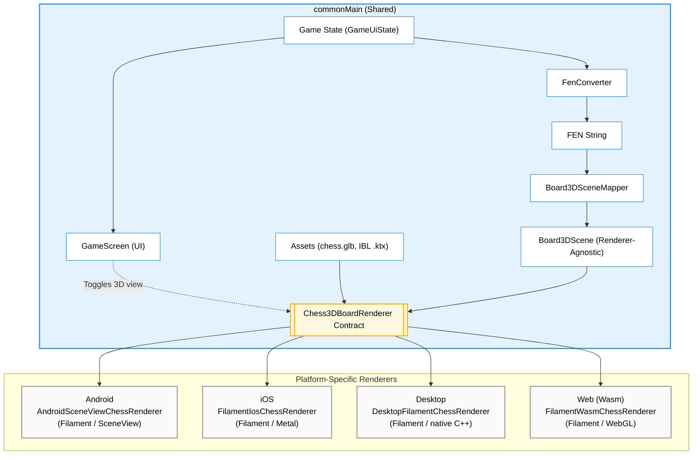

# game

Compose Multiplatform chess app with full support for all standard chess rules, a 3D view mode, and
five [AI coaching surfaces](#ai-features) (three on-device, two cloud), targeting:

- Android (minSdk 26)
- Desktop (JVM): Linux and macOS
- Web (Wasm)
- iOS

## Setup

For the desktop target on Linux and macOS, **JDK 26 is recommended**. The desktop 3D renderer uses a native C++ Filament bridge; after a clean checkout run `tools/fetch_filament_desktop.sh` to fetch the gitignored Filament desktop payload before desktop builds.

For the desktop target on Linux, install stockfish first:

```bash
sudo apt install stockfish  # For Ubuntu/Debian
sudo pacman -S stockfish    # For Arch
sudo dnf install stockfish  # For Fedora
```

For the desktop target on macOS:
```bash
brew install stockfish
```

### iOS Setup

macOS, Xcode 16+, and a working project JDK are required.
1. `tools/fetch_filament_ios.sh`
2. `open iosApp/iosApp.xcodeproj`
3. Run the `iosApp` scheme

The Stockfish engine is bundled automatically. The Filament iOS xcframeworks are fetched separately
because they are large generated dependencies and are intentionally gitignored.

## Architecture & Features

### Modules

The project is split into focused Gradle modules:

- **`:chess-core`** — the Compose-free, platform-agnostic chess engine core (all game rules,
  FEN/UCI/SAN/PGN converters, `GameViewModel`, and the pure-Kotlin 3D-board math/scene mapping). It
  has **no Compose, no russhwolf/Settings, no `java.lang.Process`**. Targets: Android, JVM (desktop),
  iOS (arm64/simulator), **JS (IR)**, and Wasm. Published to GitHub Packages as
  **`io.github.ber4444:chess-core`** (tag-driven: push `chess-core-v*` → `publish-chess-core.yml`
  publishes that version). Consumed by `:app` (below) and by the
  [React Native port](https://github.com/ber4444/react-native-kotlin-multiplatform-chess), so there
  is **no duplicated Kotlin** across the two repos — bump `chessCoreVersion` to pick up core changes.
  Also home to the [perft verification rig](docs/perft.md) — the move generator is proven correct
  against arithmetic ground truth (canonical perft counts + Stockfish cross-check).
- **`:app`** — the Compose Multiplatform app: all UI screens, platform glue, Stockfish bridges, and
  the 3D renderers. Depends on `:chess-core` via `api(project(":chess-core"))`. Also home to the
  [monetization seam](#monetization--entitlements), whose RevenueCat implementation lives in a
  `storeMain` source set shared by Android and iOS only.
- **`:androidApp`** — thin Android application wrapper (manifest, launcher icons) that depends on `:app`.
- **`:onDeviceAi`** — on-device AI orchestration (move coach, rules Q&A, opening explainer, route
  policy) in `commonMain`, with platform-specific LLM runtimes injected (Cactus on Android, Foundation
  Models on iOS, deterministic fallback on desktop/wasm/JS). Published to GitHub Packages as
  **`io.github.ber4444:onDeviceAi`** (tag-driven: push `on-device-ai-v*` → `publish-on-device-ai.yml`
  publishes both `:onDeviceAi` and `:coachApi` together). Consumed by `:app` and by the
  [React Native port](https://github.com/ber4444/react-native-kotlin-multiplatform-chess).
- **`:coachApi`** — serialization-only KMP wire models (`OpeningExplainRequest`/`Response`, etc.)
  shared by `:onDeviceAi` and the opening explainer service. Published as
  **`io.github.ber4444:coachApi`** because `:onDeviceAi` exposes its types in public signatures
  (OpeningExplainer returns `OpeningExplainResponse`), so consumers need it transitively.
- **`:server`** — JVM Ktor cloud-AI service: the opening explainer (`POST /v1/openings/explain`) and
  the streaming position chat (`POST /v1/positions/chat/stream`), both over the same pgvector
  retrieval corpus with deterministic composition; the optional provider composer always validates
  and falls back locally.
- **`:evals`** — rule-based regression suite for AI coach routes: grounding, length, reading level
  and tone, plus an exhaustive routing-invariant sweep.
- **`:litert-eval`** — a JVM-only driver that runs `LitertLmTextGenerator` (the desktop coach
  runtime) straight from the command line, so LiteRT-LM prompt/model changes can be measured without
  launching the desktop app. Depends on `:onDeviceAi` + `:coachApi` only — deliberately *not* on
  `:server`, so Ktor can't drag this module's coroutines version around (see its `build.gradle.kts`).
- **`:perft-mcp`** — a thin stdio [MCP server](docs/perft.md#the-mcp-server-perft-mcp) exposing the
  perft rig as three tools (`run_perft_gate`, `stockfish_divide`, `read_divergence`) for agent-driven
  verification loops. JVM-only; no dependency on `:app` or `:chess-core` (it shells out to gradle +
  stockfish as an adapter, not an engine).

The core↔app boundary is enforced by three seams (don't re-couple them):
  - `Piece` has no `asset` field; `:app` resolves drawables via `PieceAssets.asset()`.
  - Core types have no `@Immutable` (Compose stability hints); `:app`'s compiler re-infers stability.
  - `GameViewModel` takes a `GameSnapshotSink` (core interface), not the russhwolf `CurrentGameStore`;
    `:app` adapts via `CurrentGameStore.asSnapshotSink()`.

Each publishable module's public API surface is documented via KDoc directly in source
(`chess-core/src/commonMain`, `onDeviceAi/src/commonMain`, `coachApi/src/commonMain`) rather than
restated here. Third-party asset and dependency notices live in
[THIRD_PARTY_NOTICES.md](THIRD_PARTY_NOTICES.md).

### 3D Rendering Pipeline



### Gameplay & persistence features

- **Full Chess Rules:** The application covers all standard chess rules and includes a draw-by-agreement flow: the Stockfish engine offers a draw when it evaluates the position as drawish, and you accept or decline.
- **Game Lifecycle & Persistence:** The in-progress game is auto-saved on every move and restored on next launch (board, turn, move list). On game end, the user can **Save game** (to a persisted Game History) and **Share PGN** (platform share sheet / file dialog / download). PGN export is full Standard Algebraic Notation with the Seven Tag Roster; paste a saved PGN into lichess.org "Import game" to validate. A **History** screen lists saved games with a detail view and delete.
- **Per-move assessment:** Every ply carries a `MoveAssessment` (`cpBefore`, `cpPlayed`, `cpBest`,
  `cpLoss`, a `MoveClass` from BEST/EXCELLENT/GOOD/INACCURACY/MISTAKE/BLUNDER, and detected
  `motifs`), computed by `MoveAssessor` + `MotifDetector` in `:chess-core` and persisted on
  `MoveRecord`. This is what grounds the coach and the game summary: **code detects, the model only
  narrates.** `GameHistoryBackfiller` fills assessments in for games saved before the feature
  existed. Two caveats worth knowing: the classification thresholds (10 / 30 / 60 / 100 / 300
  centipawns) are calibrated to *Stockfish's* evaluation scale, so swapping engines invalidates
  stored assessments; and the whole record depends on the engine, so assessments are absent when no
  engine is attached.
- **Hint:** A **Hint** button asks the attached engine for the best move in the current position and
  shows it in SAN ("Hint: Try Nf3"). No LLM, no network, no tokens. Two deliberate behaviours: the
  button is **hidden when no engine is attached** (the CPU fallback picks a capture-preferring
  *random* move, which would be confidently wrong advice), and the query runs at
  `EngineDifficulty.HARD` regardless of the opponent's difficulty setting, so a hint on Easy doesn't
  teach a deliberately weakened move. It is disabled on the opponent's turn and during animation,
  and clears on the next move.
- **Engine Difficulty:** A persisted Easy / Medium / Hard / Max setting (in **Settings**) weakens or strengthens Stockfish play via the UCI `Skill Level` option and a per-move think-time budget. Applies to the Stockfish engine on every platform.
- **Settings & Navigation:** A minimal multiplatform navigation host (`AppRoot`) switches between the game, **History**, **Settings**, **Rules**, **Chat**, and the **paywall** screens. Settings holds four persisted controls: the 3D-board toggle (default on), the engine-difficulty selector, the AI Move Coach toggle (default on), and the **player side** selector — you can play as Black, in which case the engine opens.

### Board rendering, engines & verification

- **3D Board View:** The app features a playable 3D board with shared camera, tap-to-move, ray picking, and move animation logic. Desktop, iOS, and web share `FilamentEncodedChessRenderer` for FEN-to-scene, camera, selection, and transition state; their platform peers only own the Filament surface. Android uses Filament through SceneView (the visual reference); iOS uses **Metal-native Filament** through a Swift/Obj-C++ `CAMetalLayer` bridge; desktop uses **native C++ Filament** with a headless swap chain and RGBA readback into Compose; web uses **Filament (Wasm)** loading the same `chess.glb` Android uses. See `docs/plans/web-graphics-spike-result.md` and `docs/plans/ios-filament-spike-result.md` for the spike verdicts.
- **Stockfish Engine Integrations:**
  - **Android:** Pinned to Stockfish 17, as the Stockfish 18 binary exceeds GitHub's 100 MB file limit.
  - **Desktop:** Relies on system-installed binaries (e.g., via `apt` or `brew`).
  - **Web (Wasm):** Uses a lightweight `stockfish-18-lite-single.js` running in a Web Worker.
  - **iOS:** Wraps `ChessKitEngine` using an async-sync bridge and utilizes NNUE via `EvalFileSmall`.
  - **Concurrency:** UCI is a stateful single-conversation protocol, so `BaseStockfishEngine`
    serializes every exchange behind a `Mutex`, so that overlapping callers (move + evaluation +
    draw-offer assessment + hint) cannot interleave `go`/`bestmove` lines on one stdin/stdout pair
    and read each other's replies.
- **Perft Verification Rig:** The move generator is proven correct against arithmetic ground truth — [canonical perft counts](https://www.chessprogramming.org/Perft_Results) for six standard positions, plus a Stockfish `go perft` divide-diff cross-check over a seeded random walk of arbitrary midgame/endgame positions. The rig runs in CI on every PR and nightly (deep tier). A pure top-level `applyMove` (extracted from `GameViewModel.deriveNewGameState`) makes the generator testable to perft depth without ViewModel side effects. An optional MCP server (`:perft-mcp`) exposes the rig as tools for agent-driven verification loops. See **[docs/perft.md](docs/perft.md)** for the full walkthrough.

## AI features

Five AI surfaces share one seam — `:onDeviceAi` owns the route policies, prompt builders, validators
and deterministic fallbacks; `:app` owns the UI and injects the platform runtime. They differ in
where inference runs, what leaves the device, and what the free tier gets:

| Feature | Where it appears | Route & policy | Free tier | Pro tier |
|---|---|---|---|---|
| **Move Coach** | Panel below the board, after your move is answered | On-device; `AiRoutePolicies.moveCoachOffline` — `LOCAL_ONLY`, 0¢ | The deterministic explanation of that ply's `MoveAssessment`, rendered as ordinary coach text | The same assessment, phrased by the model |
| **Game Summary** | *Get Coach Summary* in the game-over popup | On-device; reuses `moveCoachOffline` | Upsell card | Full feature |
| **Rules Q&A** | **Rules** screen | On-device retrieval **and** generation; `AiRoutePolicies.rulesQaOffline` — `LOCAL_ONLY`, 0¢ | Upsell card | Full feature |
| **Opening Explainer** | Post-game panel, once per finished game | Cloud; `AiRoutePolicies.openingExplainer` — `PUBLIC_OR_SYNTHETIC`; server cost cap defaults to 1.5¢ | Upsell card | Full feature |
| **Position Chat** | **Chat** screen, any number of turns mid-game | Cloud SSE; `AiRoutePolicies.positionChat` — `PUBLIC_OR_SYNTHETIC`; server cost cap defaults to 1.5¢ | Upsell card | Full feature |

Pro is the entitlement described under [Monetization & entitlements](#monetization--entitlements);
free play is unlimited and keeps both boards, the full engine-difficulty range, the deterministic
coach, PGN export and history. Where a build cannot run a surface at all — no coach orchestrator, no
`coach.baseUrl`, no rules answerer — it renders *nothing*, not even the upsell, so the paywall never
sells a feature that would stay dead after payment.

Only the two cloud policies set `allowCloud = true`, and they carry public chess data only (FEN, SAN
move list, bounded conversation history — no user identifiers, no free-form PII). The three
on-device policies are `LOCAL_ONLY` with a 0¢ budget, so `AiRoutePolicyDecider` can never hand them a
cloud route.

**Availability per platform** — the on-device surfaces are gated differently on each target; there is
no single switch that turns "AI" on or off everywhere:

| Feature | Android | iOS | Desktop | Web |
|---|---|---|---|---|
| **Move Coach**, **Game Summary** | All builds, debug and release; first launch downloads ~200 MB in the background (see [First-run model download](#first-run-model-download)) | iOS 26.0+, a Foundation-Models-eligible device, and Apple Intelligence on in Settings (`SystemLanguageModel.default.availability`), probed at launch on every build | `CHESS_ENABLE_COACH=1 ./gradlew :app:run` | `?coach=1` on the page URL; Chrome/Edge only, since it needs WebGPU |
| **Rules Q&A** | All builds — the answerer is unconditionally available and falls back to corpus retrieval if the model has not initialized yet | Same iOS 26+ / Apple Intelligence gate as the coach | Unavailable: `defaultRulesQaAnswerer` returns `null`, and the **Rules** screen reports itself unavailable rather than rendering a dead input box | Unavailable, same as desktop |
| **Opening Explainer**, **Position Chat** | A `coach.baseUrl` / `CHESS_COACH_BASE_URL` baked in at build time — identical precedence on all four targets (see [App-side wiring](#opening-explainer-service)) | ↑ | ↑ | ↑ |

On top of its platform gate, **Move Coach** also honours the persisted **Enable AI Move Coach**
switch in Settings (`AppSettings.aiCoachEnabled`, default on). It guards only the automatic per-move
trigger, so Game Summary — attached in the same call at every entry point — still works when it is
off. Neither Rules Q&A nor the two cloud surfaces has a Settings switch.

**On-device runtimes**, injected at the entry points through the `OnDeviceTextGenerator` /
`VendorRouteExecutor` seam:

| Target | Runtime | Model |
|---|---|---|
| Android | Cactus (`com.cactuscompute:cactus:1.4.1-beta`) | `gemma3-270m`, ~200 MB `.cact`, fetched from Hugging Face into `filesDir` on first launch — no model ships in the APK (debug APK ~258 MB), and `AndroidManifest.xml` declares `INTERNET` for it. Cold start ~1–2 s *(manual hardware measurement)*. See `docs/benchmarks/on-device-ai/android-delivery-decision.md` |
| iOS | Foundation Models, via `FoundationMoveCoachBridge` registered into `FoundationModelsBridgeRegistry` from `iOSApp.swift` | The system model. Every Foundation Models call is individually `@available(iOS 26.0, *)`-gated; the app's own deployment target is 16.0, set by ChessKitEngine |
| Desktop | LiteRT-LM (`com.google.ai.edge.litertlm:litertlm-jvm`), native libs bundled inside the jar: linux-x86_64/aarch64, darwin-aarch64, win-x86_64 — **no Intel Mac**, which falls back | Qwen3-0.6B-int4, ~347 MB `.litertlm`, downloaded on first launch and cached under `~/.chess-coach-models/`. See `docs/benchmarks/on-device-ai/desktop-wasm-litert-lm.md` |
| Web (Wasm) | `@litert-lm/core` loaded from the jsdelivr CDN at runtime, running in a module Web Worker so inference stays off the main thread | `gemma-4-E2B-it-web.litertlm`, ~2 GB — the only model `@litert-lm/core` documents for web. Without WebGPU the generator reports unavailable and the orchestrator falls back to `MoveCoachFallback` |
| JS (`js(IR)`) | `UnsupportedTextGenerator` — the React Native port has no WebGPU or workers | — |

<a name="ai-routing"></a>
**How the cloud/on-device split is enforced.** `AiRoutePolicyDecider.decide(policy, context)` in
`commonMain` is the single routing authority, and its decision *carries* the chosen runtime:
`Decision.RunOnDevice(route: VendorRoute)`. There is no second step in which a route could be picked,
so no platform code can reach a different conclusion than the policy allows. The platform `actual`s
have two narrow jobs and never see an `AiRoutePolicy`:

- `probeAvailableLocalVendors()` reports **what this device can run**, as an ordered
  `List<VendorRoute>` on `AiContextSnapshot` (Android returns ML Kit *then* Cactus, so the
  "no AICore on this device" fallback is a list entry rather than a hidden branch).
- `VendorRouteExecutor.execute(route)` builds **the one generator it is handed** — an exhaustive
  `when` with no `else`, which throws if it is ever given another platform's route.

Because device capability is an *argument* rather than an `expect val`, every platform's routing is
asserted from `commonTest` on every target: `AiRoutePolicyDeciderTest` sweeps 3 vendor lists × 2
network × 3 user-setting × 5 thermal states, asserts the concrete route each context yields, and pins
the invariant that a `LOCAL_ONLY` policy never produces a route whose `isCloudCapable` is true —
backed by `AiRoutePolicy.permitsCloud()`, the one predicate that answers "may this policy go
off-device at all."

**Per-surface details** beyond the tables above:

- **Move Coach** — explains **your own move**, grounded in the `MoveAssessment` recorded for that ply
  (`cpLoss`, `MoveClass`, motifs: code detects, the model only narrates). `GameViewModel` exposes an
  `onMoveCoached` callback, fired after the engine's reply is applied and skipped when that reply
  ends the game; `MoveCoachManager` in `:app` registers it and runs a cancellable job that never
  blocks the move. The response validator enforces a 300-char bound, forbidden phrases and grounding,
  and a rejection emits the deterministic line immediately — there is no retry. See
  [On-Device AI Architecture](docs/on-device-ai-architecture.md) for the prompt and routing internals.
- **Game Summary** — feeds the finished game's PGN to the same generator (`DefaultGameSummaryOrchestrator`,
  45 s ceiling for the whole PGN-sized prompt) and reuses the *same* `VendorRouteExecutor` the coach
  warmed up, so there is no second model download. Turning points are ranked by `cpLoss`/`MoveClass`
  and cited as `[move-N]`, which `:app` renders rather than strips: `CitationSanitizer` removes
  internal corpus ids like `[lichess-…]` from every display path but deliberately preserves
  `[move-N]`, since those are meant to become tappable board jumps. Two deliberate differences from
  the coach — **no grounding validator** (any non-blank output is accepted; there is no per-move tag
  list to check it against) and it is **pull-based**. The button renders only once an orchestrator is
  attached, so it can never be pressed for nothing; a failed generation shows a fixed "review the
  PGN" line.
- **Rules Q&A** — retrieval and generation both stay on-device. The corpus is a bundled 30-passage
  FIDE/Wikibooks adaptation (`onDeviceAi/src/commonMain/resources/rulesCorpus/passages.tsv`) looked
  up with BM25 (`BundledRuleLookupTool`); see
  `docs/benchmarks/on-device-ai/rules-qa-retrieval-decision.md` for why BM25 rather than a bundled
  embedding model. iOS uses a native Foundation Models `Tool` conformance with `NLEmbedding`
  query-time ranking; Android uses native Cactus tool calling (if supported by the model) or
  structured-output prompting — the model emits a
  `{"tool":"lookup_rule","query":"…"}` envelope, Kotlin performs the real lookup, and a second
  generation turn cites the passage. An answer that fails validation falls back to composing the
  retrieved passage directly.
- **Opening Explainer** — `OpeningExplainerPanel` posts the FEN plus the first 20 SAN plies to
  `:server`, which retrieves grounded passages and composes a 2–3 sentence explanation. An unset base
  URL, a dead network, or a non-2xx response all surface as a deterministic offline message rather
  than an error state. See [Opening explainer service](#opening-explainer-service).
- **Position Chat** — cloud-only by design: there is no on-device chat generator, and an on-device
  route decision is treated as "no route". `KtorStreamingChatClient` uses `preparePost{}.execute{}` +
  `bodyAsChannel()`, so cancelling the collecting job closes the TCP connection immediately and
  leaves no orphaned server-side stream; **Stop** cancels an in-flight request (mid-token when the
  provider delivers incrementally) and **Retry** re-sends the turn,
  with `ChatViewModel` holding a single `streamJob` so at most one stream is live. It sends the last
  6 turns (`MAX_HISTORY_TURNS`) plus at most 20 SAN plies; the server caps history independently and
  re-pins retrieval every turn, so trimming old turns cannot let the grounding drift. A slow first
  token is bounded twice: `HttpTimeout` (10 s connect / 30 s socket / 60 s request) plus an
  engine-independent 45 s `withTimeout` around the whole turn. Server-side streaming, validation and
  fallbacks: [Position Chat service](#position-chat-service).

#### First-run model download

The Android model is fetched by Cactus on first launch (~200 MB). Nothing waits for it:

- `CactusTextGenerator.warmup()` returns as soon as the download **starts**, and `status()` reports
  `AiAvailability.Downloading` while it runs.
- The orchestrator is attached *before* warmup finishes, so a coached move during the download routes
  normally, sees `Downloading`, and renders the deterministic line. The board, the engine, and the
  coach panel are all fully usable throughout — the model arriving just upgrades the prose.
- Initialization goes through **one shared job**, so a re-entrant `ensureInitialized()` cannot start
  a second download of the same model. `LitertLmTextGenerator` (desktop) mirrors the same structure.
- Entry points that report a terminal state call `awaitWarmup()` rather than `warmup()`, so an init
  failure surfaces instead of sitting behind a spinner.

There is **no determinate progress bar**: Cactus exposes no progress callback.
`docs/benchmarks/on-device-ai/cactus-download-progress.md` records the file-polling design
(`CactusModel.size_mb` vs the partial file's length) that would give a real percentage and the
on-disk-layout coupling it would cost.

#### Fallback states

A fallback is not one state. `AiRoutePolicyDecider.FallbackReason` is sealed, reaches the UI typed,
and `movecoach/FallbackPresentation` maps it to exactly three designed outcomes:

| Presentation | Reasons | What the user sees |
|---|---|---|
| `Silent` | no local model, offline, no route, backgrounded, validator veto, **CRITICAL thermal** | Ordinary coach text, no error chrome — the deterministic line is the product, not a failure message |
| `Labeled` | quota exhausted | A one-line note, because waiting changes the outcome |
| `Retryable` | timeout | The note plus a **Retry** button (`MoveCoachManager.retry()` / `GameSummaryManager.retry()` replay the last request) |

The CRITICAL-thermal row is the guarantee worth naming: an overheating device degrades to the
deterministic coach and **never renders a dead panel**. That holds only because the orchestrator's
fallback text is always non-blank, which `DefaultAiCoachOrchestratorTest` pins. Adding a
`FallbackReason` is a compile error in `FallbackPresentation.of` until someone chooses its state.

### Position Chat service

The position-chat streaming endpoint is part of the same `:server` Ktor service as the opening
explainer. It is the interactive counterpart: where the explainer answers *once* at game-end, the
chat answers *repeatedly* during a game over SSE. The endpoint and client support incremental
tokens, but the deployed provider currently batches: measured behaviour was about 10.9 s to first
visible text, then one whole-answer event.

**Endpoint** — `POST /v1/positions/chat/stream` (SSE)

The request body is a `PositionChatRequest` (FEN, SAN move list ≤ 20 plies, bounded conversation
history ≤ 12 turns, user message ≤ 500 chars). The response is a stream of `data: <json>\n\n`
SSE records, each a `ChatStreamEvent`:

| `type` | Meaning |
|---|---|
| `token` | Append the `text` field to the in-flight reply |
| `done` | Turn complete and validated; `composerId` identifies the producer (`llm-chat-v1` or `template-chat-v1`) |
| `fallback` | Validation failed; replace any streamed tokens with the deterministic `text` |
| `error` | Stream failed before producing any validated text |

**Architecture** — `StreamingChatComposer` → `LlmChatComposer` (provider) → `PositionChatValidator`
→ SSE. The provider call uses `stream: true`; the parser handles both streamed
`choices[].delta.content` SSE lines (terminated by `data: [DONE]`) and one-shot
`choices[].message.content` completions (providers may respond to a `stream: true` request this
way). The deployed provider currently yields one whole-answer event; `chat-provider-oneshot` and
`chat-provider-single-delta` logs distinguish the two upstream shapes. The validator runs the same
grounding rules as the opening explainer on the
*accumulated* text at stream end; a veto emits a `fallback` event. `TemplateChatComposer` is the
zero-cost deterministic fallback.

The route writes SSE by hand over `respondBytesWriter` rather than through Ktor's `sse { }` plugin:
as of Ktor 3.5.0 that builder is GET-only (all four overloads bind `HttpMethod.Get`) and chat has to
POST a body (FEN + bounded history), which also rules out the plugin's `Heartbeat.eventProvider`.
Two settings keep a slow first token from looking like a dropped connection: a hand-rolled periodic
`: keep-alive` comment line (spec-defined as ignorable, so neither client parses it as an event)
while the composer is still thinking, and `responseWriteTimeoutSeconds = 60` on the Netty connector,
which must stay above both the heartbeat interval and a thinking model's time-to-first-token.

**Runtime configuration** — the chat endpoint shares the database, embedding model, and the whole
`COACH_LLM_*` provider/pricing block with the opening explainer (see the table in
[Opening explainer service](#opening-explainer-service)). One variable is chat-specific:

| Variable | Required | Purpose |
|---|---|---|
| `COACH_LLM_CHAT_MAX_OUTPUT_TOKENS` | no (default 2048) | Output-token budget for the chat composer, checked against `COACH_LLM_MAX_USD_CENTS` before calling the provider. Larger than the explainer's budget so a *thinking* provider model has room to reason before it emits visible content; a truncated, uncited fragment fails validation |
| `COACH_LLM_MAX_USD_CENTS` | no (default 1.5) | Per-call cost ceiling in US cents — shared with the opening explainer; the chat route checks it independently against the token budget above |

Raising `COACH_LLM_CHAT_MAX_OUTPUT_TOKENS` without also raising `COACH_LLM_MAX_USD_CENTS` will
silently push every turn over budget onto the template composer.

**App-side wiring** is shared with the opening explainer — same base-URL precedence
(`CHESS_COACH_BASE_URL` → `coach.baseUrl` → empty) and the same per-platform HTTP engine; see
[App-side wiring](#opening-explainer-service) below. An empty base URL means no chat client at all,
and every turn answers with the client-side offline line.

The endpoint is already present in the deployed `:server` image; no separate deployment step is
needed if the server is already running. Re-deploy with `fly deploy . --config server/fly.toml` to
pick up any chat-related server changes.

### Opening explainer service

The opening explainer is one of the two AI features allowed to leave the device (the other is
[Position Chat](#position-chat-service), which shares this service). A finished game sends the
opening moves (FEN + first 20 SAN plies + ECO) to a small cloud service, which retrieves relevant
opening passages from a vector corpus and composes a 2–3 sentence explanation. The app never sends
anything that identifies a user — only public/synthetic chess position data.

The service contract is [server/openapi.yaml](server/openapi.yaml) — the source of truth for the two
endpoints (`POST /v1/openings/explain` and `GET /health`). A swagger-request-validator contract test
in `:server:test` validates real responses against it. The spec is hand-written rather than generated
from the routing tree, since a contract generated from the implementation cannot catch server drift.

**Architecture** — two endpoints, one Postgres, no queues or caching tiers:

- **Retrieval** — `all-MiniLM-L6-v2` (ONNX Runtime, 384-dim) embeds the query; the four passages it
  returns come from a `passages` table with a pgvector `vector(384)` column, ordered by
  `embedding <=> $1`. The embedder is behind an `Embedder` interface with a deterministic fake, so
  `:server:test` never downloads a model.
- **Composition** — `TemplateComposer` (default, deterministic, zero model cost) stitches the
  retrieved passages into grounded sentences. `LlmComposer` calls an OpenAI-compatible provider API
  only when `COACH_LLM_API_KEY` is set; it validates the LLM output with the same grounding rules as
  the on-device coach (forbidden phrases, max length, citation + token overlap) and falls back to
  `TemplateComposer` if validation fails — unvalidated prose is never returned.
- **Corpus** — `server/corpus/` holds the five ECO openings TSVs from `lichess-org/chess-openings`
  (CC0) plus curated concept notes. The `:server:seed` task (`SeedMain`) chunks, embeds, and upserts
  them into Postgres, along with each row's ECO code and its normalized move prefix. A seed writes
  bounded batches in one transaction, replaces stale rows only after every batch succeeds, and
  records a deterministic corpus version, row count, and final sorted source id in
  `corpus_seed_state`.
- **Retrieval is book-first.** An opening is a property of its move prefix, so
  `PostgresPassageRepository` resolves the line by exact longest-prefix match on the stored move
  sequence, then fills the remaining slots with ECO-scoped and finally unscoped vector neighbours.
  Vector similarity alone identifies openings badly (measured 8/8 wrong on real openings: 1.e4 c5 →
  English Opening, 1.e4 e6 → Catalan) and a wrong answer is still fluent and cited, so nothing
  downstream can catch it. `OpeningRetrievalGroundingTest` pins eight openings with all-zero
  embeddings, so it can only pass through the book tier.
  **The `eco`/`moves` columns are `NULL` until you reseed** — applying the schema alone silently
  leaves retrieval vector-only.

**Runtime configuration** is read only from environment variables (no secrets are committed):

| Variable | Required | Purpose |
|---|---|---|
| `DATABASE_URL` | yes | Postgres connection string (Fly Postgres, Neon, etc.) with pgvector enabled |
| `COACH_EMBEDDING_MODEL` | yes | Path to the MiniLM ONNX model (baked into the Docker image at `/opt/models/model.onnx`) |
| `COACH_EMBEDDING_VOCAB` | yes | Path to the MiniLM vocab.txt (baked into the Docker image at `/opt/models/vocab.txt`) |
| `PORT` | no (default 8080) | HTTP listen port |
| `COACH_LLM_API_KEY` | no | Enables the paid LLM composer when set (with the two price vars below) |
| `COACH_LLM_API_URL` | no | OpenAI-compatible chat completions endpoint |
| `COACH_LLM_MODEL` | no | Model name (default `gpt-4.1-mini`) |
| `COACH_LLM_INPUT_USD_PER_MILLION` | no | Input token price — required to enforce the configured per-call ceiling |
| `COACH_LLM_OUTPUT_USD_PER_MILLION` | no | Output token price — required to enforce the configured per-call ceiling |
| `COACH_LLM_MAX_USD_CENTS` | no (default 1.5) | Per-call cost ceiling in US cents. Checked against the prices above *before* the request; over budget falls back to the template composer. Raise it if you raise the model's output-token budget |
| `COACH_ALLOWED_ORIGINS` | no | Comma-separated hostnames for CORS (e.g. `chess.example.com`; schemes added by server) |
| `COACH_CORPUS_DIR` | no (default `corpus`) | Seed-time only (`SeedMain`): directory holding the corpus TSVs to chunk, embed, and upsert |

All of these are shared with the [position-chat route](#position-chat-service) — there is no
chat-specific variable.

On Fly.io the runtime detects `FLY_APP_NAME` and uses Fly Proxy's `Fly-Client-IP` header for the
bounded, expiring in-process request limiter (30 req/min per client). Outside Fly, the direct peer
address is used.

**App-side wiring** — the cloud client is injected from `:app` (`KtorOpeningExplainerClient`), never
hardcoded to prod. The base URL comes from build config, resolved in this precedence:

1. `CHESS_COACH_BASE_URL` environment variable (CI / deploy builds)
2. `coach.baseUrl` key in `local.properties` (local development)
3. empty string (default — the client is `null`, so the explainer shows offline guidance)

The `generateOpeningExplainerConfig` Gradle task generates an `internal const val
OPENING_EXPLAINER_BASE_URL` from whichever source is set. When the URL is empty, offline, or the
service returns non-2xx, `DefaultOpeningExplainer` produces a deterministic fallback — surfaced as a
normal product state in the panel.

#### Deploying to Fly.io

The service is packaged as a multi-stage Docker image (`server/Dockerfile`): a build stage runs
`./gradlew :server:installDist`, and the `eclipse-temurin:21-jre-jammy` runtime stage bakes in the
pinned MiniLM ONNX model + vocab. `server/fly.toml` configures the app
(`compose-chess-opening-coach`, region `sjc`, `min_machines_running = 1` so an interactive chat turn
never waits on a machine boot, health check `GET /health`). Its `dockerfile` path is resolved
relative to `server/`, the directory holding `fly.toml` — not the build context.

No credential is committed — the base URL below is a public hostname, but every secret
(`DATABASE_URL`, `COACH_LLM_API_KEY`) stays a Fly secret. Deployment is intentionally a human step:

```bash
# 1. Create the Fly app (does not deploy yet)
fly launch --no-deploy --config server/fly.toml

# 2. Provision Postgres with pgvector and attach it
# Note: As of late 2024, Fly defaults to PG 18 which lacks pgvector. We explicitly use PG 16.
fly pg create --name compose-chess-pg --region sjc --initial-cluster-size 1 --image-ref flyio/postgres-flex:16.3
fly pg attach compose-chess-pg --app compose-chess-opening-coach
# This sets DATABASE_URL as a Fly secret automatically. Verify:
fly secrets list --app compose-chess-opening-coach

# 3. Enable the pgvector extension (needed before the schema applies on startup)
fly ssh console --app compose-chess-opening-coach --command \
  'psql "$DATABASE_URL" -c "CREATE EXTENSION IF NOT EXISTS vector;"'
# Alternatively, the app's applySchema() runs "CREATE EXTENSION IF NOT EXISTS vector" on boot,
# so the first deploy will create it if the connecting role has permission.

# 4. Deploy the service (the schema is applied idempotently on startup)
# Note: The `.` is required to set the build context to the repository root so it can find gradlew.
fly deploy . --config server/fly.toml

# 5. Seed the opening corpus into the live database. Seeding is the :server:seed Gradle task, run
#    locally against the prod DATABASE_URL (pull it from `fly secrets`); point the MiniLM
#    model/vocab paths at your local copies:
DATABASE_URL=… COACH_EMBEDDING_MODEL=model.onnx COACH_EMBEDDING_VOCAB=vocab.txt ./gradlew :server:seed
#    Or invoke SeedMain inside the Fly container, on the runtime classpath the image ships:
fly ssh console --app compose-chess-opening-coach --command \
  'DATABASE_URL="$DATABASE_URL" COACH_EMBEDDING_MODEL=/opt/models/model.onnx COACH_EMBEDDING_VOCAB=/opt/models/vocab.txt java -cp "/opt/coach-server/lib/*" com.example.coachserver.SeedMain'


# 6. Verify the service is live
curl https://compose-chess-opening-coach.fly.dev/health
# → {"status":"ok","releaseVersion":"…","corpus":{"ready":true,…}}

# 6a. Verify the database is seeded from this image's corpus rather than inferring it from API prose.
DATABASE_URL=… ./gradlew :server:verifyCorpus

# 7. Collect diagnostics for R-1 hand-review (before testing with the app):
tools/collect_cloud_samples.sh https://compose-chess-opening-coach.fly.dev
# → inspect the written samples directory and record the verdict

# 8. Point the app at it (local dev via local.properties, or CI/deploy via env var):
echo "coach.baseUrl=https://compose-chess-opening-coach.fly.dev" >> local.properties
# or: export CHESS_COACH_BASE_URL=https://compose-chess-opening-coach.fly.dev

# 9. Verify retrieval end to end (eight real openings; sends eco = null like the real clients):
tools/verify_opening_retrieval.sh
# → each row should show the expected ECO and `wrong ECO retrieved: 0/8`

# 10. (Optional) Enable the paid LLM composer for richer prose. Set the cost cap explicitly,
#    sized as described below:
fly secrets set --app compose-chess-opening-coach \
  COACH_LLM_API_KEY=… \
  COACH_LLM_API_URL=https://api.openai.com/v1/chat/completions \
  COACH_LLM_MODEL=gpt-4.1-mini \
  COACH_LLM_INPUT_USD_PER_MILLION=0.40 \
  COACH_LLM_OUTPUT_USD_PER_MILLION=1.60 \
  COACH_LLM_MAX_USD_CENTS=2.5   # see the sizing note below; 1.5 is the built-in default
```

> **`COACH_LLM_MAX_USD_CENTS` is a per-request ceiling on *expected* cost.**
> `ProviderCostBudget.admits()` prices each request before calling out, charging
> `expectedOutputTokens` plus the input prompt. That constant is **1400**, measured — not the ~100
> tokens of visible answer: `./gradlew :evals:run` against gemini-3.6-flash (100 opening calls,
> 2026-08-05) billed p50 **1344**, p90 **2011**, max 2044 output tokens per call, because a thinking
> model's deliberation is billed at the output rate and is roughly 13× the reply. Compute yours as
> `(prompt_chars / 3 × input_price_per_M + 1400 × output_price_per_M) / 1e6 × 100` cents — about
> 0.25¢ at the gpt-4.1-mini prices above, about 1.15¢ at gemini-3.6-flash's 1.50/7.50. The built-in
> default is **1.5¢**, sized to admit both.
>
> It previously charged the full `maxOutputTokens` (2048) instead, ~11× an ordinary call, so the cap
> had to be set an order of magnitude above intended spend before *any* call was permitted — at this
> very default, every request was rejected before the network and the composer silently served
> template text (`opening-provider-skipped budget` in the logs). The ceiling is still enforced: the
> provider is sent `max_tokens`, and a configuration whose worst case exceeds
> `ProviderCostBudget.WORST_CASE_MULTIPLE` × the cap is refused outright.
> Recalibrate `expectedOutputTokens` from the `billed output tokens` figure that
> `./gradlew :evals:run` writes into the `local-llm-compose` scorecard note.

> **`COACH_LLM_API_URL` and `COACH_LLM_MODEL` must come from the same provider.** The URL defaults to
> `api.openai.com`, so set it explicitly for any other host, and list what that host serves with
> `curl -s -H "Authorization: Bearer $KEY" "${URL%/chat/completions}/models"`.

The deployed base URL, verified against `GET /health` (returns `ok`):

**https://compose-chess-opening-coach.fly.dev**

Point the app at it with `coach.baseUrl=https://compose-chess-opening-coach.fly.dev` in
`local.properties`, or `CHESS_COACH_BASE_URL` for CI/deploy builds — the precedence is listed under
[App-side wiring](#opening-explainer-service). Both cloud surfaces (Opening Explainer and Position
Chat) share this one base URL.

> **Security Note:** This endpoint is **unauthenticated and open** — client attestation such as
> Firebase App Check is an Android/Firebase primitive and does not cover the four client targets
> here (including desktop and web). The Fly app holds only `DATABASE_URL` and `COACH_LLM_API_KEY` as
> secrets, but abuse of this open endpoint can incur LLM provider costs if not monitored.

### AI coach eval harness

The `:evals` module is a rule-based regression gate that scores every available generator against a
golden set. It has no judge model — v1 is rule-based only.

- **Golden set** — `evals/golden/candidates.json` holds 100 semantically distinct opening positions
  generated from the checked-in Lichess opening lines. Each case has `fen`, `bestMoveUci`, `tags`,
  and (for openings) `eco` + `expectedConcepts`. These are *candidates*: the repository owner must
  hand-check best-move and concept labels before treating the scorecard as article-grade evidence
  (see `evals/golden/README.md`).
- **Scorer** — move cases use the production `MoveCoachResponseValidator`; opening cases require all
  `expectedConcepts` to appear in the output (concept-coverage). Both check the 300-char length bound.
- **Fluency** — `FluencyScorer` adds a Flesch-Kincaid reading bound plus three string-checkable tone
  rules (process-praise-not-person-praise, criticism-carries-a-next-step, no "I see / I notice").
  The bound is **per surface and calibrated against that surface's own deterministic composer**
  (p90 + 1.0) rather than a single absolute target, and the grades are ordinal, not real US grade
  levels; see [fluency-calibration.md](docs/benchmarks/on-device-ai/fluency-calibration.md).
- **Routing** — `RouterEvalSuite` sweeps every policy across the Cartesian product of the runtime
  context axes and checks four named invariants (*never-reaches*, *always-reaches*, *carries*,
  *declares*), reported as a `route-selection` row. Its mutation test injects a deliberately-broken
  decider and asserts the sweep goes red, so the proof is itself proven. The scaffolding lives in
  `:evals`, never `:onDeviceAi` — that module is published and consumed by the React Native port.
- **Routes** — `:evals:run` executes every case against `FakeTextGenerator`, the deterministic
  fallback, `TemplateComposer` via a local in-process server instance, and (when
  `COACH_DEPLOYED_URL` is set and reachable) the deployed cloud service. It writes
  `evals/scorecard.md` with grounding-violation, reading-grade, fluency-violation, retry, fallback,
  and length-violation rates per route. On-device numbers (Cactus, Foundation Models) are collected
  manually on hardware and marked as such in the scorecard.
- **CI gate** — `.github/workflows/ai-coach-evals.yml` runs `:evals:run` on every PR touching
  `:onDeviceAi`, `:coachApi`, `:server`, `:evals`, or the opening-explainer app code. A grounding
  violation in any automated route fails the build. **Grounding is currently the only gating
  column** — reading grade, fluency and route-selection are scored and reported but do not yet fail
  the build.

```bash
./gradlew :evals:run          # regenerate evals/scorecard.md; fails on grounding regression
COACH_DEPLOYED_URL=https://… ./gradlew :evals:run   # also score the live deployment
EVAL_CALIBRATION=1 ./gradlew :evals:run             # print per-route reading-grade distributions
```

## Monetization & entitlements

Feature gating goes through an injected `Entitlements` seam in `:app`'s `monetization/` package —
never resolved statically, and never in `:chess-core`, which is the artifact the React Native repo
compiles against and must stay free of any billing dependency. The interface is
`isProUnlocked: StateFlow<Boolean>` / `availablePlans()` / `purchase(planId)` / `restorePurchases()`,
published to the UI through `LocalEntitlements`. Its wire types are store-agnostic so they can cross
into `commonMain`: `ProPlan` (opaque id, title, the store's own localized `priceLabel`, optional
detail, `isBestValue`) and `PurchaseOutcome` (`Purchased` / `Cancelled` / `Unavailable` / `Failed`),
where `Cancelled` is distinct so backing out of the store sheet raises no error.

Three implementations, and which one you get is deliberate. **All three start locked**, so the
paywall renders on every target and its layout is checkable at phone, desktop and browser sizes:

| Implementation | Used by | Behaviour |
|---|---|---|
| `RevenueCatEntitlements` | Android, iOS | Backed by the RevenueCat KMP SDK, checking the `pro` entitlement (`DEFAULT_ENTITLEMENT_ID`). Built by `MainActivity` / `MainViewController` through `createOrNull(apiKey, debugLogging)`, which returns `null` on a blank key; the entry point then calls `refresh()` explicitly, so no network call runs from `init {}` on the composition thread |
| `NoOpEntitlements` | Desktop, Web | No store on those targets: offers one synthetic plan priced "Free", and `purchase()` unlocks locally. Entry points seed it from `AppSettings.proUnlocked` and pass `AppSettings::setProUnlocked` as `onUnlockChanged`, so the unlock survives a restart. That key is never read on Android or iOS, where a device-writable setting would be a paywall bypass |
| `UnconfiguredEntitlements` | The `AppRoot` **default** | Locked; `purchase()` returns `Unavailable` |

`UnconfiguredEntitlements` is the default so that previews, Compose UI tests, and any caller that
omits the argument neither configure a billing SDK nor make a network call. It is not
interchangeable with `NoOpEntitlements`, whose `purchase()` unlocks Pro on the spot.

**What's gated.** `ProGate` wraps Game Summary and Opening Explainer in `GameScreen`; the Rules and
Chat screens own their own `SubScreenScaffold`, so `AppRoot` branches on `isProUnlocked()` and drops
a bare `ProUpsellCard` into its own scaffold instead of nesting a gate; `MoveCoachManager.proUnlocked`
gives free users the deterministic coach line as a finished answer rather than an upsell mid-game.
A gate also takes an `available` flag, and when it is false **nothing renders — not even the
upsell**: a build with no coach orchestrator, no `coach.baseUrl`, or no rules answerer must not sell
a feature that would stay dead after payment. Note that `isProUnlocked()` treats a null
`LocalEntitlements` as unrestricted (right for previews), so **no Compose UI test can catch a
paywall regression** — that surface is hand-tested. `EntitlementsTest` covers the parts that are
unit-testable: the locked defaults, the storeless unlock, and its persistence round-trip.

**The paywall** is `PaywallScreen`, reached as `Screen.PAYWALL` from any upsell card's *See Pro*
button. It lists the Pro surfaces, renders one selectable row per `ProPlan` (pre-selecting
`isBestValue`, else the first), and offers *Unlock Pro* plus *Restore purchases*. Three states are
distinct on purpose: plans still loading, an **empty** plan list — "purchases aren't available on
this device right now", covering a storeless target, a missing key and an empty offering — and Pro
already active. It reads `LocalEntitlements` directly rather than through `isProUnlocked()`, which
would report Pro as active in a preview.

The SDK dependency is `com.revenuecat.purchases:purchases-kmp-core`, which publishes Android and iOS
variants only. It therefore lives in `:app`'s `storeMain` intermediate source set
(`commonMain` ← `storeMain` ← `androidMain` + `iosMain`), and the `iosSimulatorArm64` test binary
carries an explicit `-L` to the host's Swift toolchain for RevenueCat's prebuilt Swift objects.

**Configuration.** Keys are read at build time with the same precedence as the coach base URL and
generated into `storeMain` by `generateRevenueCatConfig`; nothing is committed:

```bash
# env, or revenuecat.androidKey / revenuecat.iosKey in local.properties
export REVENUECAT_ANDROID_KEY=goog_…
export REVENUECAT_IOS_KEY=appl_…

# optional Test Store keys — debug builds prefer these, release builds never use them
export REVENUECAT_ANDROID_TEST_KEY=test_…
export REVENUECAT_IOS_TEST_KEY=test_…
```

`revenueCatApiKey(debug)` picks between them. A **debug** build (`FLAG_DEBUGGABLE` on Android,
`Platform.isDebugBinary` on iOS) uses the test key when one is set and otherwise falls back to the
production key, so an existing single-key setup keeps working. A **release** build never resolves to
a test key at all — shipping one would give every user a free, unverifiable "purchase".

With no key configured, `RevenueCatEntitlements.createOrNull(...)` returns `null` and the entry point
falls back to the locked default — a fresh clone builds and runs, it just can't purchase, and the
Pro surfaces show their upsell. What Pro actually adds is per-surface; see the tier columns in
[AI features](#ai-features).

## Benchmarking

To measure performance metrics of the on-device AI integration (init times, tokens/sec, memory), the project includes a dedicated benchmarking harness for both Android and iOS targets. 
- [On-Device Benchmark Harness](docs/benchmark-harness.md) — Execution instructions and architecture details for the harness.
- [Benchmark Schema](docs/benchmarks/on-device-ai/move-coach-benchmark-schema.md) — The schema and target latency thresholds for the metrics.

## Useful Gradle tasks

- `./gradlew :chess-core:check` runs the chess-core test suite across all targets (desktop + iOS sim + JS)
- `./gradlew :chess-core:jsNodeTest` runs just the Kotlin/JS tests (the target the React Native port consumes)
- `./gradlew test` runs shared unit tests
- `./gradlew :androidApp:assembleDebug :androidApp:installDebug` builds and installs the Android app
- `./gradlew :app:run` launches the desktop app
- `CHESS_ENABLE_COACH=1 ./gradlew :app:run` launches the desktop app **with the on-device Move Coach enabled** (downloads the Qwen3-0.6B model, ~347 MB, on first launch; cached at `~/.chess-coach-models/`). Without the env var the coach panel stays hidden; Android has no equivalent gate and attaches on all builds.
- `./gradlew :app:wasmJsBrowserDevelopmentRun` starts the web target
- `./gradlew :app:wasmJsBrowserDevelopmentRun` then open the page with **`?coach=1`** appended to the URL to enable the on-device Move Coach (Chrome/Edge only — requires WebGPU; loads `gemma-4-E2B-it-web.litertlm` ~2 GB from Hugging Face). Without `?coach=1` the coach panel stays hidden.
- `./gradlew :app:wasmJsBrowserDevelopmentRun` # run web target
- `./gradlew :app:wasmJsBrowserDevelopmentWebpack` # build web dev bundle without dev server
- `./gradlew :app:connectedAndroidDeviceTest` # Android UI tests (needs device/emulator)
- `./gradlew :app:iosSimulatorArm64Test` runs iOS Compose UI tests
- `./gradlew :app:desktopTest --tests "*board3d*"` runs the 3D desktop tests (DesktopRendererSmokeTest writes `build/chess3d-*.png` to eyeball the render)
- `./gradlew :chess-core:publishToMavenLocal` publishes `io.github.ber4444:chess-core` to the local Maven cache (for local cross-repo iteration)
- `./gradlew :coachApi:build` builds and tests the serialization-only wire-model module
- `./gradlew :coachApi:publishToMavenLocal :onDeviceAi:publishToMavenLocal` publishes both AI artifacts to the local Maven cache (for local cross-repo iteration with the RN port)
- `./gradlew :server:test` runs the cloud-AI service tests — opening explainer + position chat (Testcontainers Postgres; skips without Docker)
- `./gradlew :litert-eval:run` runs the desktop LiteRT-LM coach runtime headlessly (prompt/model iteration without launching the app)
- `./gradlew :server:seed` seeds the opening corpus into a Postgres database (needs `DATABASE_URL` + embedding model paths)
- `./gradlew :evals:run` runs the rule-based eval harness and regenerates `evals/scorecard.md` (fails on grounding regression; includes the `local-template-chat` route: 200 scored turns, 100 cases × 2 turns, 0% grounding-drift violations)
- `./gradlew :chess-core:desktopTest --tests "*Perft*"` runs the [perft gate](docs/perft.md) (canonical counts + Stockfish cross-check)
- `./gradlew :chess-core:desktopTest --tests "*PerftDeepTest*" -Dperft.deep=true` runs the deep perft tier (nightly-only depths; slow)
- `./gradlew :perft-mcp:test :perft-mcp:installDist` builds the [perft MCP server](docs/perft.md#the-mcp-server-perft-mcp)
- `tools/ios_3d_screenshot.sh` captures the real iOS 3D board from a booted simulator

### Publishing `chess-core`

The core is published to GitHub Packages from CI (`.github/workflows/publish-chess-core.yml`), driven
by a tag. To publish a new version:

```bash
git tag -a chess-core-v0.2.0 -m "Publish io.github.ber4444:chess-core:0.2.0"
git push origin chess-core-v0.2.0
```

The version is the tag with the `chess-core-v` prefix stripped. Consumers (the RN port, or any other
Kotlin project) add the GitHub Packages Maven repo (auth: PAT with `read:packages`) and depend on
`io.github.ber4444:chess-core:<version>`.

### Publishing `onDeviceAi` & `coachApi`

Both artifacts publish together from one tag (`:onDeviceAi` depends on `:coachApi` for wire models),
via `publish-on-device-ai.yml`:

```bash
git tag -a on-device-ai-v0.1.0 -m "Publish io.github.ber4444:onDeviceAi:0.1.0 + coachApi"
git push origin on-device-ai-v0.1.0
```

[Article with screenshots](https://medium.com/p/f6a983db0e45)
