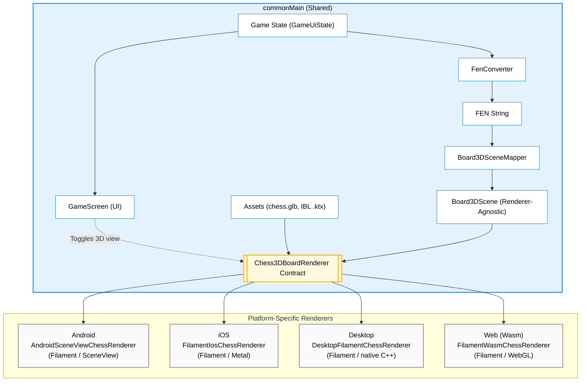

# game

Compose Multiplatform chess app with full support for all standard chess rules, a 3D view mode, and
five [AI coaching surfaces](#ai-features) (three on-device, two cloud), targeting:

- Android (minSdk 26)
- Desktop (JVM): Linux and macOS
- Web (Wasm)
- iOS

## Setup

For the desktop target on Linux and macOS, **JDK 26 is recommended**. The desktop 3D renderer uses a native C++ Filament bridge; after a clean checkout run `tools/fetch_filament_desktop.sh` to fetch the gitignored Filament desktop payload before desktop builds.

For the desktop target on Linux, install stockfish first:

```bash
sudo apt install stockfish  # For Ubuntu/Debian
sudo pacman -S stockfish    # For Arch
sudo dnf install stockfish  # For Fedora
```

For the desktop target on macOS:
```bash
brew install stockfish
```

### iOS Setup

macOS, Xcode 16+, and a working project JDK are required.
1. `tools/fetch_filament_ios.sh`
2. `open iosApp/iosApp.xcodeproj`
3. Run the `iosApp` scheme

The Stockfish engine is bundled automatically. The Filament iOS xcframeworks are fetched separately
because they are large generated dependencies and are intentionally gitignored.

## Architecture & Features

### Modules

The project is split into focused Gradle modules:

- **`:chess-core`** — the Compose-free, platform-agnostic chess engine core (all game rules,
  FEN/UCI/SAN/PGN converters, `GameViewModel`, and the pure-Kotlin 3D-board math/scene mapping). It
  has **no Compose, no russhwolf/Settings, no `java.lang.Process`**. Targets: Android, JVM (desktop),
  iOS (arm64/simulator), **JS (IR)**, and Wasm. Published to GitHub Packages as
  **`io.github.ber4444:chess-core`** (tag-driven: push `chess-core-v*` → `publish-chess-core.yml`
  publishes that version). Consumed by `:app` (below) and by the
  [React Native port](https://github.com/ber4444/react-native-kotlin-multiplatform-chess), so there
  is **no duplicated Kotlin** across the two repos — bump `chessCoreVersion` to pick up core changes.
  Also home to the [perft verification rig](docs/perft.md) — the move generator is proven correct
  against arithmetic ground truth (canonical perft counts + Stockfish cross-check).
- **`:app`** — the Compose Multiplatform app: all UI screens, platform glue, Stockfish bridges, and
  the 3D renderers. Depends on `:chess-core` via `api(project(":chess-core"))`.
- **`:androidApp`** — thin Android application wrapper (manifest, launcher icons) that depends on `:app`.
- **`:onDeviceAi`** — on-device AI orchestration (move coach, rules Q&A, opening explainer, route
  policy) in `commonMain`, with platform-specific LLM runtimes injected (Cactus on Android, Foundation
  Models on iOS, deterministic fallback on desktop/wasm/JS). Published to GitHub Packages as
  **`io.github.ber4444:onDeviceAi`** (tag-driven: push `on-device-ai-v*` → `publish-on-device-ai.yml`
  publishes both `:onDeviceAi` and `:coachApi` together). Consumed by `:app` and by the
  [React Native port](https://github.com/ber4444/react-native-kotlin-multiplatform-chess).
- **`:coachApi`** — serialization-only KMP wire models (`OpeningExplainRequest`/`Response`, etc.)
  shared by `:onDeviceAi` and the opening explainer service. Published as
  **`io.github.ber4444:coachApi`** because `:onDeviceAi` exposes its types in public signatures
  (OpeningExplainer returns `OpeningExplainResponse`), so consumers need it transitively.
- **`:server`** — JVM Ktor cloud-AI service: the opening explainer (`POST /v1/openings/explain`) and
  the streaming position chat (`POST /v1/positions/chat/stream`), both over the same pgvector
  retrieval corpus with deterministic composition; the optional provider composer always validates
  and falls back locally.
- **`:evals`** — rule-based regression suite for AI coach routes: grounding, length, reading level
  and tone, plus an exhaustive routing-invariant sweep.
- **`:litert-eval`** — a JVM-only driver that runs `LitertLmTextGenerator` (the desktop coach
  runtime) straight from the command line, so LiteRT-LM prompt/model changes can be measured without
  launching the desktop app. Depends on `:onDeviceAi` + `:coachApi` only — deliberately *not* on
  `:server`, so Ktor can't drag this module's coroutines version around (see its `build.gradle.kts`).
- **`:perft-mcp`** — a thin stdio [MCP server](docs/perft.md#the-mcp-server-perft-mcp) exposing the
  perft rig as three tools (`run_perft_gate`, `stockfish_divide`, `read_divergence`) for agent-driven
  verification loops. JVM-only; no dependency on `:app` or `:chess-core` (it shells out to gradle +
  stockfish as an adapter, not an engine).

The core↔app boundary is enforced by three seams (don't re-couple them):
  - `Piece` has no `asset` field; `:app` resolves drawables via `PieceAssets.asset()`.
  - Core types have no `@Immutable` (Compose stability hints); `:app`'s compiler re-infers stability.
  - `GameViewModel` takes a `GameSnapshotSink` (core interface), not the russhwolf `CurrentGameStore`;
    `:app` adapts via `CurrentGameStore.asSnapshotSink()`.

Each publishable module's public API surface is documented via KDoc directly in source
(`chess-core/src/commonMain`, `onDeviceAi/src/commonMain`, `coachApi/src/commonMain`) rather than
restated here. Third-party asset and dependency notices live in
[THIRD_PARTY_NOTICES.md](THIRD_PARTY_NOTICES.md).

### 3D Rendering Pipeline



### Gameplay & persistence features

- **Full Chess Rules:** The application covers all standard chess rules and includes an explicit draw-by-agreement flow where the Stockfish engine evaluates whether to accept or decline draw offers.
- **Game Lifecycle & Persistence:** The in-progress game is auto-saved on every move and restored on next launch (board, turn, move list). On game end, the user can **Save game** (to a persisted Game History) and **Share PGN** (platform share sheet / file dialog / download). PGN export is full Standard Algebraic Notation with the Seven Tag Roster; paste a saved PGN into lichess.org "Import game" to validate. A **History** screen lists saved games with a detail view and delete.
- **Per-move assessment:** Every ply carries a `MoveAssessment` (`cpBefore`, `cpPlayed`, `cpBest`,
  `cpLoss`, a `MoveClass` from BEST/EXCELLENT/GOOD/INACCURACY/MISTAKE/BLUNDER, and detected
  `motifs`), computed by `MoveAssessor` + `MotifDetector` in `:chess-core` and persisted on
  `MoveRecord`. This is what grounds the coach and the game summary: **code detects, the model only
  narrates.** `GameHistoryBackfiller` fills assessments in for games saved before the feature
  existed. Two caveats worth knowing: the classification thresholds (10 / 30 / 60 / 100 / 300
  centipawns) are calibrated to *Stockfish's* evaluation scale, so swapping engines invalidates
  stored assessments; and the whole record depends on the engine, so assessments are absent when no
  engine is attached.
- **Hint:** A **Hint** button asks the attached engine for the best move in the current position and
  shows it in SAN ("Hint: Try Nf3"). No LLM, no network, no tokens. Two deliberate behaviours: the
  button is **hidden when no engine is attached** (the CPU fallback picks a capture-preferring
  *random* move, which would be confidently wrong advice), and the query runs at
  `EngineDifficulty.HARD` regardless of the opponent's difficulty setting, so a hint on Easy doesn't
  teach a deliberately weakened move. It is disabled on the opponent's turn and during animation,
  and clears on the next move.
- **Engine Difficulty:** A persisted Easy / Medium / Hard / Max setting (in **Settings**) weakens or strengthens Stockfish play via the UCI `Skill Level` option and a per-move think-time budget. Applies to the Stockfish engine on every platform.
- **Settings & Navigation:** A minimal multiplatform navigation host (`AppRoot`) switches between the game, **History**, **Settings**, **Rules**, and **Chat** screens. Settings holds four persisted controls: the 3D-board toggle (default on), the engine-difficulty selector, the AI Move Coach toggle (default on), and the **player side** selector — you can play as Black, in which case the engine opens.

### Board rendering, engines & verification

- **3D Board View:** The app features a playable 3D board with shared camera, tap-to-move, ray picking, and move animation logic. Desktop, iOS, and web share `FilamentEncodedChessRenderer` for FEN-to-scene, camera, selection, and transition state; their platform peers only own the Filament surface. Android uses Filament through SceneView (the visual reference); iOS uses **Metal-native Filament** through a Swift/Obj-C++ `CAMetalLayer` bridge; desktop uses **native C++ Filament** with a headless swap chain and RGBA readback into Compose; web uses **Filament (Wasm)** loading the same `chess.glb` Android uses. See `docs/plans/web-graphics-spike-result.md` and `docs/plans/ios-filament-spike-result.md` for the spike verdicts.
- **Stockfish Engine Integrations:**
  - **Android:** Pinned to Stockfish 17, as the Stockfish 18 binary exceeds GitHub's 100 MB file limit.
  - **Desktop:** Relies on system-installed binaries (e.g., via `apt` or `brew`).
  - **Web (Wasm):** Uses a lightweight `stockfish-18-lite-single.js` running in a Web Worker.
  - **iOS:** Wraps `ChessKitEngine` using an async-sync bridge and utilizes NNUE via `EvalFileSmall`.
  - **Concurrency:** UCI is a stateful single-conversation protocol, so `BaseStockfishEngine`
    serializes every exchange behind a `Mutex`. Without it, overlapping callers (move + evaluation +
    draw-offer assessment + hint, all of which now exist) interleave `go`/`bestmove` lines on one
    stdin/stdout pair and read each other's replies. Don't remove it as redundant — the paths that
    collide are not obviously concurrent from any single call site.
- **Perft Verification Rig:** The move generator is proven correct against arithmetic ground truth — [canonical perft counts](https://www.chessprogramming.org/Perft_Results) for six standard positions, plus a Stockfish `go perft` divide-diff cross-check over a seeded random walk of arbitrary midgame/endgame positions. The rig runs in CI on every PR and nightly (deep tier). A pure top-level `applyMove` (extracted from `GameViewModel.deriveNewGameState`) makes the generator testable to perft depth without ViewModel side effects. An optional MCP server (`:perft-mcp`) exposes the rig as tools for agent-driven verification loops. See **[docs/perft.md](docs/perft.md)** for the full walkthrough.

## AI features

There are **five** distinct AI surfaces. They share one seam (`:onDeviceAi` owns the routing policy,
prompt builders, validators, and deterministic fallbacks; `:app` owns the UI and injects the runtime),
but they differ in where inference runs, what leaves the device, and how each is gated:

| Feature | Where it appears | Route & policy | Runtime | Gate |
|---|---|---|---|---|
| **Move Coach** | Panel below the board, after Black's move animates | On-device; `AiRoutePolicies.moveCoachOffline` — `LOCAL_ONLY`, 0¢ | Cactus (Android), Foundation Models (iOS), LiteRT-LM (desktop/web) | Platform gate **and** the *Enable AI Move Coach* switch in Settings (default on) |
| **Game Summary** | *Get Coach Summary* button in the end-of-game popup | On-device; reuses `moveCoachOffline` | Same generator as the coach | Same platform gate as the coach (no Settings switch) |
| **Rules Q&A** | **Rules** screen | On-device retrieval **and** generation; `AiRoutePolicies.rulesQaOffline` — `LOCAL_ONLY`, 0¢ | Foundation Models `Tool` (iOS), structured-output prompting over Cactus (Android); no answerer on desktop/web/JS | Always on where an answerer exists |
| **Opening Explainer** | Post-game panel, once per finished game | Cloud; `AiRoutePolicies.openingExplainer` — `PUBLIC_OR_SYNTHETIC`, 0.2¢ ceiling | `:server` (pgvector retrieval + template or provider LLM composer) | Requires a configured `coach.baseUrl` / `CHESS_COACH_BASE_URL` |
| **Position Chat** | **Chat** screen, any number of turns mid-game | Cloud, token-streaming; `AiRoutePolicies.positionChat` — `PUBLIC_OR_SYNTHETIC`, 0.2¢ ceiling | Same `:server`, streaming SSE route | Requires a configured `coach.baseUrl` / `CHESS_COACH_BASE_URL` |

Two of the five (Opening Explainer, Position Chat) are cloud routes; they are the *only* policies with
`allowCloud = true`, and both send public chess data only. The three on-device policies are
`LOCAL_ONLY` with a 0¢ budget, so `AiRoutePolicyDecider` can never hand them a cloud route.

<a name="ai-routing"></a>
**How that guarantee is enforced.** `AiRoutePolicyDecider.decide(policy, context)` in `commonMain` is
the single routing authority, and its decision *carries* the chosen runtime:
`Decision.RunOnDevice(route: VendorRoute)`. There is no second step in which a route could be picked,
so no platform code can reach a different conclusion than the policy allows. The platform `actual`s
have two narrow jobs and never see an `AiRoutePolicy`:

- `probeAvailableLocalVendors()` reports **what this device can run**, as an ordered
  `List<VendorRoute>` on `AiContextSnapshot` (Android returns ML Kit *then* Cactus, so the
  "no AICore on this device" fallback is a list entry rather than a hidden branch).
- `VendorRouteExecutor.execute(route)` builds **the one generator it is handed** — an exhaustive
  `when` with no `else`, which throws if it is ever given another platform's route.

Because device capability is an *argument* rather than an `expect val`, every platform's routing is
asserted from `commonTest` on every target: `AiRoutePolicyDeciderTest` sweeps 3 vendor lists × 2
network × 3 user-setting × 5 thermal states, asserts the concrete route each context yields, and pins
the invariant that a `LOCAL_ONLY` policy never produces a route whose `isCloudCapable` is true —
backed by `AiRoutePolicy.permitsCloud()`, the one predicate that answers "may this policy go
off-device at all."

**Enabling each feature, per platform** — the on-device features are gated very differently across
targets; there is no single switch that turns "AI" on or off everywhere:

| Feature | Android | iOS | Desktop | Web |
|---|---|---|---|---|
| **Move Coach** | **All builds** — the `FLAG_DEBUGGABLE` gate was removed for the store release, so release users get the coach (and its ~200 MB first-launch model download). Plus the **Enable AI Move Coach** Settings switch (default on) | Automatic, no build flag or debug/release distinction: requires **iOS 26.0+**, a Foundation-Models-eligible device, and Apple Intelligence turned on in Settings (`SystemLanguageModel.default.availability`). Plus the same Settings switch | `CHESS_ENABLE_COACH=1` env var, e.g. `CHESS_ENABLE_COACH=1 ./gradlew :app:run`. Plus the same Settings switch | `?coach=1` on the page URL (Chrome/Edge only — needs WebGPU). Plus the same Settings switch |
| **Game Summary** | Same debug-build gate as Move Coach (attached in the same call) — **not** affected by the Move Coach Settings switch, since only the automatic per-move trigger reads it | Same iOS 26+/Apple Intelligence gate as Move Coach, same switch-independence | Same `CHESS_ENABLE_COACH=1` gate as Move Coach, same switch-independence | Same `?coach=1` gate as Move Coach, same switch-independence |
| **Rules Q&A** | **All builds** — the Android answerer needs Cactus initialized, which now happens at launch on every build via the coach's init path. No separate flag, no Settings switch | Same iOS 26+/Apple Intelligence gate as Move Coach. No separate flag, no Settings switch | Never available — `defaultRulesQaAnswerer` returns `null`; the **Rules** screen reports itself unavailable | Never available, same as desktop |
| **Opening Explainer** | Needs `coach.baseUrl` in `local.properties` or `CHESS_COACH_BASE_URL`, baked into the binary at build time — identical precedence on all four targets (see [App-side wiring](#opening-explainer-service)) | ↑ | ↑ | ↑ |
| **Position Chat** | Same build-time base-URL config as Opening Explainer | ↑ | ↑ | ↑ |

- **On-device AI Move Coach:** A Compose panel (`MoveCoachPanel`) that surfaces a natural-language explanation of **the player's own move**, grounded in the `MoveAssessment` recorded for that ply (see below). It coached the *engine's* move until the move-assessment work landed; the subject switched because "here is what your move cost you" is coaching and "here is what the engine did" is commentary. `GameViewModel` exposes an `onMoveCoached` callback (fired after the engine's move is applied, skipped when that move ends the game) plus an `aiCoachEnabled` flag; `MoveCoachManager` in `:app` registers the callback and runs the actual `triggerCoach(...)` — cancellable, never blocks the move. The panel is gated twice: the platform must have attached an orchestrator (Android attaches on **all** builds — the `FLAG_DEBUGGABLE` gate was removed for the store release; desktop `CHESS_ENABLE_COACH=1`, web `?coach=1`), and the persisted **Enable AI Move Coach** switch in Settings (`AppSettings.aiCoachEnabled`, default on) must be on. Backed by the shared KMP module `:onDeviceAi` holding the routing policy (`AiRoutePolicies.moveCoachOffline`), prompt builder, response validator (300-char bound, forbidden phrases, grounding), and deterministic fallback in `commonMain`; platform runtimes are injected at the entry points. See [On-Device AI Architecture](docs/on-device-ai-architecture.md) for the coach's prompt and routing internals.
  - **Android backend:** **Cactus (`com.cactuscompute:cactus:1.4.1-beta`)** — Cactus runtime. The `gemma3-270m` model (~200 MB .cact) is downloaded from Hugging Face by Cactus on first launch into `filesDir` (debug APK ~258 MB; no model bundled in the APK). `AndroidManifest.xml` declares `INTERNET` so Cactus can fetch the model. Cold start ~1–2 s *(manual hardware measurement: device model, OS build, sample count)*. Replaced the earlier LiteRT-LM path (7–9 s cold init *(manual hardware measurement)*, streaming crash, no resolvable Maven coordinate) and the ML Kit Prompt API path (narrow AICore device support); `MoveCoachModelAsset.kt` and `AndroidCoachWiring` were removed in the migration. See `docs/benchmarks/on-device-ai/android-delivery-decision.md`.
  - **iOS backend:** **Foundation Models** (Apple Intelligence) via `FoundationMoveCoachBridge` registered into `FoundationModelsBridgeRegistry` from `iOSApp.swift`. Requires **iOS 26.0+** (the app's own deployment target is 16.0, set by ChessKitEngine — every Foundation Models call is individually `@available(iOS 26.0, *)`-gated) plus `SystemLanguageModel.default.availability == .available` (a Foundation-Models-eligible device with Apple Intelligence turned on in Settings). Unlike the other three backends there is **no build flag or debug/release distinction** — `MainViewController` probes availability at launch on every build and falls back to rule-based text when Apple Intelligence is unavailable, whether that's an old OS, an ineligible device, or the feature simply being off. iOS has **not** been migrated to Cactus yet — it stays on Foundation Models, though the `:onDeviceAi` KMP module makes that swap feasible later.
  - **Desktop backend:** **LiteRT-LM** (`com.google.ai.edge.litertlm:litertlm-jvm`, Google AI Edge) — the Kotlin/JVM API over LiteRT-LM, with native libs bundled inside the jar (linux-x86_64 / linux-aarch64 / darwin-aarch64 / win-x86_64; **no Intel Mac** — those hosts fall back). The Qwen3-0.6B-int4 model (~347 MB `.litertlm`) is downloaded from Hugging Face on first launch and cached under `~/.chess-coach-models/`. Gated behind `CHESS_ENABLE_COACH=1` (env var) — without it the coach panel stays hidden (the previous default). Wired and compiling, pending on-device verification. See `docs/benchmarks/on-device-ai/desktop-wasm-litert-lm.md`.
  - **Wasm backend:** **LiteRT-LM for Web** (`@litert-lm/core`, loaded from the jsdelivr CDN at runtime) running in a module Web Worker so inference is off the main thread. Uses `gemma-4-E2B-it-web.litertlm` (~2 GB, the only model `@litert-lm/core` officially documents for web). Requires **WebGPU** (Chrome/Edge); on Firefox/Safari the generator reports unavailable and the orchestrator falls back to the deterministic `MoveCoachFallback`. Gated behind `?coach=1` on the page URL. Wired and compiling, pending on-device verification.
  - **JS target** (`js(IR){nodejs()}`): still `UnsupportedTextGenerator` — the React Native port has no WebGPU/workers.
- **Game Summary (on-device):** The end-of-game counterpart to the per-move coach: a **Get Coach Summary** button in the game-over popup feeds the finished game's **PGN** to the same on-device generator and renders a short "what happened in this game" paragraph. `GameSummaryManager` (`:app`) owns the UI state; `DefaultGameSummaryOrchestrator` (`:onDeviceAi`) runs route → generate → fallback with a 45 s ceiling for the whole PGN-sized prompt. The summary is built from the per-ply `MoveAssessment` records: turning points are ranked by `cpLoss`/`MoveClass` and cited as `[move-N]`, which `:app` renders rather than strips (`CitationSanitizer` removes internal corpus ids like `[lichess-…]` from every display path, but deliberately preserves `[move-N]` — those are meant to become tappable board jumps). It reuses `AiRoutePolicies.moveCoachOffline`, so it is `LOCAL_ONLY` and free, and it reuses the *same* `VendorRouteExecutor` the coach warmed up — no second model download. Two deliberate differences from the coach: the summary has **no grounding validator** (any non-blank output is accepted — there is no per-move tag list to check it against), and it is **pull-based** (nothing runs until the button is pressed). It shares the coach's *platform* gate (attached in the same call at every entry point — desktop without `CHESS_ENABLE_COACH=1`, web without `?coach=1`, or Foundation Models unavailable on iOS leave it unattached; Android now attaches on all builds) but **not** the coach's Settings switch: **Enable AI Move Coach** only guards the automatic per-move trigger, so turning it off still leaves the summary button usable. The UI state defaults to `Unavailable` (button hidden) until an orchestrator is attached; when no orchestrator is ever attached the button never renders, so there is no way to press it and get nothing back. When generation fails or the route falls back it shows a fixed "review the PGN" line.
- **Opening Explainer (cloud route):** When a game ends, a post-game panel (`OpeningExplainerPanel`) fetches a short, grounded explanation of the opening from a small Ktor + Postgres + pgvector service (`:server`). One of the two cloud policies (`AiRoutePolicies.openingExplainer`, `PUBLIC_OR_SYNTHETIC`, 0.2¢ ceiling — the other is Position Chat below); the on-device coach/summary/rules policies can never reach it. The cloud client is injected from `:app`; if the base URL is unset, the network is down, or the service returns non-2xx, the panel shows a deterministic offline-guidance message instead. See [Opening explainer service](#opening-explainer-service) below for deployment.
- **Position Chat (cloud, streaming):** An interactive multi-turn chat about the current board position. A **Chat** button opens `ChatScreen`, where the player can type a question and watch the assistant's reply appear token-by-token. The feature is routed to the cloud (`AiRoutePolicies.positionChat`, `PUBLIC_OR_SYNTHETIC`, `allowCloud = true`) — the move coach stays `LOCAL_ONLY` and never reaches this route. There is deliberately **no on-device chat implementation**: the on-device generators stay scoped to the coach and summary, and an on-device route decision is treated as "no route". Requests carry only public chess data (FEN, SAN move list, bounded conversation history); no user identifiers or free-form PII are sent.
  - **Configuration:** Same build-time base-URL config as the Opening Explainer (see [App-side wiring](#opening-explainer-service) below) — with no URL configured, every turn answers with the static offline line, not a network error.
  - **Streaming:** `KtorStreamingChatClient` uses `preparePost{}.execute{}` + `bodyAsChannel()` so that cancelling the collecting `Job` closes the TCP connection immediately — no orphaned server-side streams. The server emits genuine SSE (`data: <json>\n\n`), and the client parses each `ChatStreamEvent` (token / done / fallback / error) as it arrives.
  - **Stop & Retry:** A **Stop** button cancels the in-flight stream mid-token; a **Retry** button re-sends the same turn. `ChatViewModel` manages a single `streamJob` so at most one stream is live at a time.
  - **Conversation window:** `ChatViewModel` sends the last **6** turns (`MAX_HISTORY_TURNS`) plus at most 20 SAN plies; the server independently caps history at 12 turns, the move list at 20, and the user message at 500 chars. The server re-pins retrieval on every turn, so trimming old turns can't let the grounding drift.
  - **Stall protection:** Long time-to-first-token (retrieval plus a "thinking" provider model) is the normal case, so both ends are explicitly tuned for it: the client installs `HttpTimeout` (10 s connect / 30 s socket / 60 s request) *and* an engine-independent 45 s `withTimeout` around the whole turn, because a `bodyAsChannel()` read inside `execute{}` has not reliably honoured CIO's socket timeout. The server writes a periodic `: keep-alive` SSE comment so an idle connection isn't severed by Fly's edge proxy, and raises Netty's `responseWriteTimeoutSeconds` to 60 (its 10 s default is shorter than the heartbeat interval and was force-closing chats before the first token).
  - **Grounding & validation:** The server route (`POST /v1/positions/chat/stream`) retrieves grounding passages from the same pgvector corpus as the opening explainer, builds a citation-pinned prompt, and runs the same forbidden-phrase / citation / token-overlap validator on the *accumulated* text at stream end. A validator veto emits a `fallback` event (`TemplateChatComposer`'s deterministic, passage-grounded answer), so unvalidated prose is never shown to the user.
  - **Two fallback layers:** *Server-side* — a validator veto, a missing provider key, or an over-budget cost estimate substitutes the grounded `TemplateChatComposer` answer, still delivered as SSE. *Client-side* — when there is no cloud client at all or the stream errors mid-flight, `DefaultPositionChat` emits one `fallback` event carrying a fixed offline sentence (generic principles, no retrieval). Either way the chat surface always shows a response. See [Position Chat service](#position-chat-service) below for the server endpoint and deployment.
- **Rules Q&A (on-device):** A `LOCAL_ONLY` feature distinct from both the move coach (no retrieval) and the opening explainer (cloud retrieval). A **Rules** screen lets the player ask a natural-language chess-rules question; retrieval and generation stay entirely on-device. The corpus is a bundled 30-passage FIDE/Wikibooks adaptation (`onDeviceAi/src/commonMain/resources/rulesCorpus/passages.tsv`) looked up via BM25 (`BundledRuleLookupTool`). iOS uses a native Foundation Models `Tool` conformance with `NLEmbedding` query-time ranking, gated by the same iOS 26+/Apple Intelligence availability check as the move coach (no separate flag). Android uses structured-output prompting (the model emits a `{"tool":"lookup_rule","query":"…"}` envelope, Kotlin does the real lookup, then a second generation turn cites the passage) — on **all** Android builds since the coach's debug gate was removed: `defaultRulesQaAnswerer` checks `isCactusInitialized()`, and Cactus is now initialized at launch on every build, so release Android gets a live answerer too. Nothing in this feature checks the build type directly; it inherits whatever the coach's init path does. An answer that doesn't cite a retrieved passage ID is rejected and falls back to a static rules summary. There is no Settings switch for this feature (unlike the move coach) — availability is purely platform/build gated: `RulesQaStateHolder` starts in `RulesQaUiState.Unavailable` whenever `defaultRulesQaAnswerer` returns `null` (desktop, web, JS), and the **Rules** screen reports itself unavailable rather than rendering a dead input box. See `docs/benchmarks/on-device-ai/rules-qa-retrieval-decision.md` for why BM25 was chosen over a bundled embedding model.

### Position Chat service

The position-chat streaming endpoint is part of the same `:server` Ktor service as the opening
explainer. It is the interactive counterpart: where the explainer answers *once* at game-end, the
chat answers *repeatedly* during a game, streaming tokens back as they are generated.

**Endpoint** — `POST /v1/positions/chat/stream` (SSE)

The request body is a `PositionChatRequest` (FEN, SAN move list ≤ 20 plies, bounded conversation
history ≤ 12 turns, user message ≤ 500 chars). The response is a stream of `data: <json>\n\n`
SSE records, each a `ChatStreamEvent`:

| `type` | Meaning |
|---|---|
| `token` | Append the `text` field to the in-flight reply |
| `done` | Turn complete and validated; `composerId` identifies the producer (`llm-chat-v1` or `template-chat-v1`) |
| `fallback` | Validation failed; replace any streamed tokens with the deterministic `text` |
| `error` | Stream failed before producing any validated text |

**Architecture** — `StreamingChatComposer` → `LlmChatComposer` (provider) → `PositionChatValidator`
→ SSE. The provider call uses `stream: true`; the parser handles both streamed
`choices[].delta.content` SSE lines (terminated by `data: [DONE]`) and one-shot
`choices[].message.content` completions (some providers respond to a `stream: true` request this
way on cache hits). The validator runs the same grounding rules as the opening explainer on the
*accumulated* text at stream end; a veto emits a `fallback` event. `TemplateChatComposer` is the
zero-cost deterministic fallback.

The route writes SSE by hand over `respondBytesWriter` rather than through Ktor's `sse { }` plugin,
because that builder is GET-only and chat has to POST a body (FEN + bounded history). Re-verified
against **Ktor 3.5.0**: all four `sse` overloads take `(Route, [path], handler)` with no method
parameter, and the bytecode binds `HttpMethod.Get`. The same constraint rules out 3.5's
`Heartbeat.eventProvider`, which is a property of the plugin's session — hence the hand-rolled
keep-alive below rather than the built-in one. Two settings
keep a slow first token from looking like a dropped connection: a periodic `: keep-alive` comment
line (spec-defined as ignorable, so neither client parses it as an event) while the composer is still
thinking, and `responseWriteTimeoutSeconds = 60` on the Netty connector — the 10 s default is shorter
than both the heartbeat interval and a thinking model's time-to-first-token, and was force-closing
connections mid-turn.

**Runtime configuration** — the chat endpoint shares the database, embedding model, and the whole
`COACH_LLM_*` provider/pricing block with the opening explainer (see the table in
[Opening explainer service](#opening-explainer-service)). One variable is chat-specific:

| Variable | Required | Purpose |
|---|---|---|
| `COACH_LLM_CHAT_MAX_OUTPUT_TOKENS` | no (default 2048) | Output-token budget for the chat composer, checked against `COACH_LLM_MAX_USD_CENTS` before calling the provider. Deliberately larger than the explainer's fixed 90-token budget so a *thinking* provider model has room to reason before it emits visible content — a truncated, uncited fragment fails validation and shows up as an unexplained fallback |
| `COACH_LLM_MAX_USD_CENTS` | no (default 0.2) | Per-call cost ceiling in US cents — shared with the opening explainer; the chat route checks it independently against the token budget above |

Raising `COACH_LLM_CHAT_MAX_OUTPUT_TOKENS` without also raising `COACH_LLM_MAX_USD_CENTS` will
silently push every turn over budget onto the template composer.

**App-side wiring** is shared with the opening explainer — same base-URL precedence
(`CHESS_COACH_BASE_URL` → `coach.baseUrl` → empty) and the same per-platform HTTP engine; see
[App-side wiring](#opening-explainer-service) below. An empty base URL means no chat client at all,
and every turn answers with the client-side offline line.

The endpoint is already present in the deployed `:server` image; no separate deployment step is
needed if the server is already running. Re-deploy with `fly deploy . --config server/fly.toml` to
pick up any chat-related server changes.

### Opening explainer service

The opening explainer is one of the two AI features allowed to leave the device (the other is
[Position Chat](#position-chat-service), which shares this service). A finished game sends the
opening moves (FEN + first 20 SAN plies + ECO) to a small cloud service, which retrieves relevant
opening passages from a vector corpus and composes a 2–3 sentence explanation. The app never sends
anything that identifies a user — only public/synthetic chess position data.

The service contract is [server/openapi.yaml](server/openapi.yaml) — the source of truth for the two
endpoints (`POST /v1/openings/explain` and `GET /health`). A swagger-request-validator contract test
in `:server:test` validates real responses against it. While Ktor 3.4.0 added runtime `.describe {}`
OpenAPI generation, we deliberately retain the hand-written spec; a contract generated from the
implementation cannot catch server drift because it *is* the server. Contract-first design only has
teeth when the contract is independent of the implementation.

**Architecture** — two endpoints, one Postgres, no queues or caching tiers:

- **Retrieval** — `all-MiniLM-L6-v2` (ONNX Runtime, 384-dim) embeds the query (ECO name + opening
  moves); `ORDER BY embedding <=> $1 LIMIT 4` pulls the four closest passages from a `passages`
  table with a pgvector `vector(384)` column. The embedder is behind an `Embedder` interface with a
  deterministic fake, so `:server:test` never downloads a model.
- **Composition** — `TemplateComposer` (default, deterministic, zero model cost) stitches the
  retrieved passages into grounded sentences. `LlmComposer` calls an OpenAI-compatible provider API
  only when `COACH_LLM_API_KEY` is set; it validates the LLM output with the same grounding rules as
  the on-device coach (forbidden phrases, max length, citation + token overlap) and falls back to
  `TemplateComposer` if validation fails — unvalidated prose is never returned.
- **Corpus** — `server/corpus/` holds the five ECO openings TSVs from `lichess-org/chess-openings`
  (CC0) plus curated concept notes. The `:server:seed` task (`SeedMain`) chunks, embeds, and upserts
  them into Postgres.

**Runtime configuration** is read only from environment variables (no secrets are committed):

| Variable | Required | Purpose |
|---|---|---|
| `DATABASE_URL` | yes | Postgres connection string (Fly Postgres, Neon, etc.) with pgvector enabled |
| `COACH_EMBEDDING_MODEL` | yes | Path to the MiniLM ONNX model (baked into the Docker image at `/opt/models/model.onnx`) |
| `COACH_EMBEDDING_VOCAB` | yes | Path to the MiniLM vocab.txt (baked into the Docker image at `/opt/models/vocab.txt`) |
| `PORT` | no (default 8080) | HTTP listen port |
| `COACH_LLM_API_KEY` | no | Enables the paid LLM composer when set (with the two price vars below) |
| `COACH_LLM_API_URL` | no | OpenAI-compatible chat completions endpoint |
| `COACH_LLM_MODEL` | no | Model name (default `gpt-4.1-mini`) |
| `COACH_LLM_INPUT_USD_PER_MILLION` | no | Input token price — required to enforce the 0.2¢ ceiling |
| `COACH_LLM_OUTPUT_USD_PER_MILLION` | no | Output token price — required to enforce the 0.2¢ ceiling |
| `COACH_LLM_MAX_USD_CENTS` | no (default 0.2) | Per-call cost ceiling in US cents. Checked against the prices above *before* the request; over budget falls back to the template composer. Raise it if you raise the model's output-token budget |
| `COACH_ALLOWED_ORIGINS` | no | Comma-separated hostnames for CORS (e.g. `chess.example.com`; schemes added by server) |
| `COACH_CORPUS_DIR` | no (default `corpus`) | Seed-time only (`SeedMain`): directory holding the corpus TSVs to chunk, embed, and upsert |

All of these are shared with the [position-chat route](#position-chat-service) — there is no
chat-specific variable.

On Fly.io the runtime detects `FLY_APP_NAME` and uses Fly Proxy's `Fly-Client-IP` header for the
bounded, expiring in-process request limiter (30 req/min per client). Outside Fly, the direct peer
address is used.

**App-side wiring** — the cloud client is injected from `:app` (`KtorOpeningExplainerClient`), never
hardcoded to prod. The base URL comes from build config, resolved in this precedence:

1. `CHESS_COACH_BASE_URL` environment variable (CI / deploy builds)
2. `coach.baseUrl` key in `local.properties` (local development)
3. empty string (default — the client is `null`, so the explainer shows offline guidance)

The `generateOpeningExplainerConfig` Gradle task generates an `internal const val
OPENING_EXPLAINER_BASE_URL` from whichever source is set. When the URL is empty, offline, or the
service returns non-2xx, `DefaultOpeningExplainer` produces a deterministic fallback — surfaced as a
normal product state in the panel.

#### Deploying to Fly.io

The service is packaged as a multi-stage Docker image (`server/Dockerfile`): a build stage runs
`./gradlew :server:installDist`, and the `eclipse-temurin:21-jre-jammy` runtime stage bakes in the
pinned MiniLM ONNX model + vocab. `server/fly.toml` configures the app
(`compose-chess-opening-coach`, region `sjc`, `min_machines_running = 1` so an interactive chat turn
never waits on a machine boot, health check `GET /health`). Its `dockerfile` path is resolved
relative to `server/`, the directory holding `fly.toml` — not the build context.

No credential is committed — the base URL below is a public hostname, but every secret
(`DATABASE_URL`, `COACH_LLM_API_KEY`) stays a Fly secret. Deployment is intentionally a human step:

```bash
# 1. Create the Fly app (does not deploy yet)
fly launch --no-deploy --config server/fly.toml

# 2. Provision Postgres with pgvector and attach it
# Note: As of late 2024, Fly defaults to PG 18 which lacks pgvector. We explicitly use PG 16.
fly pg create --name compose-chess-pg --region sjc --initial-cluster-size 1 --image-ref flyio/postgres-flex:16.3
fly pg attach compose-chess-pg --app compose-chess-opening-coach
# This sets DATABASE_URL as a Fly secret automatically. Verify:
fly secrets list --app compose-chess-opening-coach

# 3. Enable the pgvector extension (needed before the schema applies on startup)
fly ssh console --app compose-chess-opening-coach --command \
  'psql "$DATABASE_URL" -c "CREATE EXTENSION IF NOT EXISTS vector;"'
# Alternatively, the app's applySchema() runs "CREATE EXTENSION IF NOT EXISTS vector" on boot,
# so the first deploy will create it if the connecting role has permission.

# 4. Deploy the service (the schema is applied idempotently on startup)
# Note: The `.` is required to set the build context to the repository root so it can find gradlew.
fly deploy . --config server/fly.toml

# 5. Seed the opening corpus into the live database.
#    `installDist` produces a single `bin/server` script (the app); there is no `bin/server-seed`.
#    So the reliable way to seed the prod DB is the :server:seed Gradle task, run locally against
#    the prod DATABASE_URL (pull it from `fly secrets`). The MiniLM model/vocab paths are the
#    Docker image bake-in defaults; point them at your local copies for the seed run:
DATABASE_URL=… COACH_EMBEDDING_MODEL=model.onnx COACH_EMBEDDING_VOCAB=vocab.txt ./gradlew :server:seed
#    Alternatively, run the seed JVM inside the Fly container directly (no separate seed script;
#    invoke SeedMain on the runtime classpath the image ships):
fly ssh console --app compose-chess-opening-coach --command \
  'DATABASE_URL="$DATABASE_URL" COACH_EMBEDDING_MODEL=/opt/models/model.onnx COACH_EMBEDDING_VOCAB=/opt/models/vocab.txt java -cp "/opt/coach-server/lib/*" com.example.coachserver.SeedMain'


# 6. Verify the service is live
curl https://compose-chess-opening-coach.fly.dev/health
# → ok

# 7. Point the app at it (local dev via local.properties, or CI/deploy via env var):
echo "coach.baseUrl=https://compose-chess-opening-coach.fly.dev" >> local.properties
# or: export CHESS_COACH_BASE_URL=https://compose-chess-opening-coach.fly.dev

# 8. (Optional) Enable the paid LLM composer for richer prose:
fly secrets set --app compose-chess-opening-coach \
  COACH_LLM_API_KEY=… \
  COACH_LLM_API_URL=https://api.openai.com/v1/chat/completions \
  COACH_LLM_MODEL=gpt-4.1-mini \
  COACH_LLM_INPUT_USD_PER_MILLION=0.40 \
  COACH_LLM_OUTPUT_USD_PER_MILLION=1.60
```

> **Why no `bin/server-seed`?** The `application` plugin's `installDist` generates one launcher
> script (`bin/server`, wired to `ApplicationKt` by `server/build.gradle.kts:57`); the seed
> `JavaExec` task (`mainClass = SeedMain`, `server/build.gradle.kts:68`) is a Gradle-side entry
> point, not a separate installed binary. That's why the in-Fly path invokes `SeedMain` on the
> shipped `lib/*` classpath directly, and the local path uses `./gradlew :server:seed`. Do not put
> database URLs or provider keys in this README or any `.env` file.

The deployed base URL, verified against `GET /health` (returns `ok`):

**https://compose-chess-opening-coach.fly.dev**

Point the app at it with `coach.baseUrl=https://compose-chess-opening-coach.fly.dev` in
`local.properties`, or `CHESS_COACH_BASE_URL` for CI/deploy builds — the precedence is listed under
[App-side wiring](#opening-explainer-service). Both cloud surfaces (Opening Explainer and Position
Chat) share this one base URL.

> **Security Note:** This endpoint is currently **unauthenticated and open**. Firebase App Check was evaluated but ultimately removed because it is primarily an Android/Firebase primitive, whereas this application supports four client targets (including desktop and web). The Fly app holds only `DATABASE_URL` and `COACH_LLM_API_KEY` as secrets, but abuse of this open endpoint could incur LLM provider costs if not monitored.

### AI coach eval harness

The `:evals` module is a rule-based regression gate that scores every available generator against a
golden set. It has no judge model — v1 is rule-based only.

- **Golden set** — `evals/golden/candidates.json` holds 100 semantically distinct opening positions
  generated from the checked-in Lichess opening lines. Each case has `fen`, `bestMoveUci`, `tags`,
  and (for openings) `eco` + `expectedConcepts`. These are *candidates*: the repository owner must
  hand-check best-move and concept labels before treating the scorecard as article-grade evidence
  (see `evals/golden/README.md`).
- **Scorer** — move cases use the production `MoveCoachResponseValidator`; opening cases require all
  `expectedConcepts` to appear in the output (concept-coverage). Both check the 300-char length bound.
- **Fluency** — `FluencyScorer` adds a Flesch-Kincaid reading bound plus three string-checkable tone
  rules (process-praise-not-person-praise, criticism-carries-a-next-step, no "I see / I notice").
  The bound is **per surface and calibrated against that surface's own deterministic composer**
  (p90 + 1.0), not a single absolute target — one grade-6 bound across all surfaces failed the
  opening route 100% of the time while measuring nothing. The grades are ordinal, not real US grade
  levels; see [fluency-calibration.md](docs/benchmarks/on-device-ai/fluency-calibration.md).
- **Routing** — `RouterEvalSuite` sweeps every policy across the Cartesian product of the runtime
  context axes and checks four named invariants (*never-reaches*, *always-reaches*, *carries*,
  *declares*), reported as a `route-selection` row. Its mutation test injects a deliberately-broken
  decider and asserts the sweep goes red, so the proof is itself proven. The scaffolding lives in
  `:evals`, never `:onDeviceAi` — that module is published and consumed by the React Native port.
- **Routes** — `:evals:run` executes every case against `FakeTextGenerator`, the deterministic
  fallback, `TemplateComposer` via a local in-process server instance, and (when
  `COACH_DEPLOYED_URL` is set and reachable) the deployed cloud service. It writes
  `evals/scorecard.md` with grounding-violation, reading-grade, fluency-violation, retry, fallback,
  and length-violation rates per route. On-device numbers (Cactus, Foundation Models) are collected
  manually on hardware and marked as such in the scorecard.
- **CI gate** — `.github/workflows/ai-coach-evals.yml` runs `:evals:run` on every PR touching
  `:onDeviceAi`, `:coachApi`, `:server`, `:evals`, or the opening-explainer app code. A grounding
  violation in any automated route fails the build. **Grounding is currently the only gating
  column** — reading grade, fluency and route-selection are scored and reported but do not yet fail
  the build.

```bash
./gradlew :evals:run          # regenerate evals/scorecard.md; fails on grounding regression
COACH_DEPLOYED_URL=https://… ./gradlew :evals:run   # also score the live deployment
EVAL_CALIBRATION=1 ./gradlew :evals:run             # print per-route reading-grade distributions
```

## Benchmarking

To measure performance metrics of the on-device AI integration (init times, tokens/sec, memory), the project includes a dedicated benchmarking harness for both Android and iOS targets. 
- [On-Device Benchmark Harness](docs/benchmark-harness.md) — Execution instructions and architecture details for the harness.
- [Benchmark Schema](docs/benchmarks/on-device-ai/move-coach-benchmark-schema.md) — The schema and target latency thresholds for the metrics.

## Useful Gradle tasks

- `./gradlew :chess-core:check` runs the chess-core test suite across all targets (desktop + iOS sim + JS)
- `./gradlew :chess-core:jsNodeTest` runs just the Kotlin/JS tests (the target the React Native port consumes)
- `./gradlew test` runs shared unit tests
- `./gradlew :androidApp:assembleDebug :androidApp:installDebug` builds and installs the Android app
- `./gradlew :app:run` launches the desktop app
- `CHESS_ENABLE_COACH=1 ./gradlew :app:run` launches the desktop app **with the on-device Move Coach enabled** (downloads the Qwen3-0.6B model, ~347 MB, on first launch; cached at `~/.chess-coach-models/`). Without the env var the coach panel stays hidden. (Android no longer has an equivalent gate — it attaches on all builds.)
- `./gradlew :app:wasmJsBrowserDevelopmentRun` starts the web target
- `./gradlew :app:wasmJsBrowserDevelopmentRun` then open the page with **`?coach=1`** appended to the URL to enable the on-device Move Coach (Chrome/Edge only — requires WebGPU; loads `gemma-4-E2B-it-web.litertlm` ~2 GB from Hugging Face). Without `?coach=1` the coach panel stays hidden.
- `./gradlew :app:wasmJsBrowserDevelopmentRun` # run web target
- `./gradlew :app:wasmJsBrowserDevelopmentWebpack` # build web dev bundle without dev server
- `./gradlew :app:connectedAndroidDeviceTest` # Android UI tests (needs device/emulator)
- `./gradlew :app:iosSimulatorArm64Test` runs iOS Compose UI tests
- `./gradlew :app:desktopTest --tests "*board3d*"` runs the 3D desktop tests (DesktopRendererSmokeTest writes `build/chess3d-*.png` to eyeball the render)
- `./gradlew :chess-core:publishToMavenLocal` publishes `io.github.ber4444:chess-core` to the local Maven cache (for local cross-repo iteration)
- `./gradlew :coachApi:build` builds and tests the serialization-only wire-model module
- `./gradlew :coachApi:publishToMavenLocal :onDeviceAi:publishToMavenLocal` publishes both AI artifacts to the local Maven cache (for local cross-repo iteration with the RN port)
- `./gradlew :server:test` runs the cloud-AI service tests — opening explainer + position chat (Testcontainers Postgres; skips without Docker)
- `./gradlew :litert-eval:run` runs the desktop LiteRT-LM coach runtime headlessly (prompt/model iteration without launching the app)
- `./gradlew :server:seed` seeds the opening corpus into a Postgres database (needs `DATABASE_URL` + embedding model paths)
- `./gradlew :evals:run` runs the rule-based eval harness and regenerates `evals/scorecard.md` (fails on grounding regression; includes the `local-template-chat` route: 200 scored turns, 100 cases × 2 turns, 0% grounding-drift violations)
- `./gradlew :chess-core:desktopTest --tests "*Perft*"` runs the [perft gate](docs/perft.md) (canonical counts + Stockfish cross-check)
- `./gradlew :chess-core:desktopTest --tests "*PerftDeepTest*" -Dperft.deep=true` runs the deep perft tier (nightly-only depths; slow)
- `./gradlew :perft-mcp:test :perft-mcp:installDist` builds the [perft MCP server](docs/perft.md#the-mcp-server-perft-mcp)
- `tools/ios_3d_screenshot.sh` captures the real iOS 3D board from a booted simulator

### Publishing `chess-core`

The core is published to GitHub Packages from CI (`.github/workflows/publish-chess-core.yml`), driven
by a tag. To publish a new version:

```bash
git tag -a chess-core-v0.2.0 -m "Publish io.github.ber4444:chess-core:0.2.0"
git push origin chess-core-v0.2.0
```

The version is the tag with the `chess-core-v` prefix stripped. Consumers (the RN port, or any other
Kotlin project) add the GitHub Packages Maven repo (auth: PAT with `read:packages`) and depend on
`io.github.ber4444:chess-core:<version>`.

### Publishing `onDeviceAi` & `coachApi`

Both artifacts publish together from one tag (`:onDeviceAi` depends on `:coachApi` for wire models),
via `publish-on-device-ai.yml`:

```bash
git tag -a on-device-ai-v0.1.0 -m "Publish io.github.ber4444:onDeviceAi:0.1.0 + coachApi"
git push origin on-device-ai-v0.1.0
```

[Article with screenshots](https://medium.com/p/f6a983db0e45)
