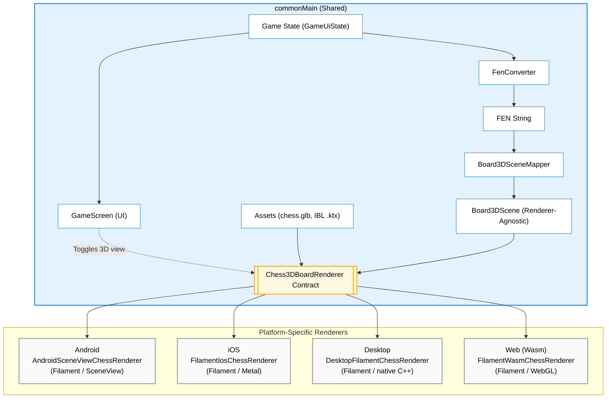

# game

Compose Multiplatform chess app with full support for all standard chess rules and a 3D view mode, targeting:

- Android
- Desktop (JVM): Linux and macOS
- Web (Wasm)
- iOS

## Setup

For the desktop target on Linux and macOS, **JDK 26 is recommended**. The desktop 3D renderer uses a native C++ Filament bridge; after a clean checkout run `tools/fetch_filament_desktop.sh` to fetch the gitignored Filament desktop payload before desktop builds.

For the desktop target on Linux, install stockfish first:

```bash
sudo apt install stockfish  # For Ubuntu/Debian
sudo pacman -S stockfish    # For Arch
sudo dnf install stockfish  # For Fedora
```

For the desktop target on macOS:
```bash
brew install stockfish
```

### iOS Setup

macOS, Xcode 16+, and a working project JDK are required.
1. `tools/fetch_filament_ios.sh`
2. `open iosApp/iosApp.xcodeproj`
3. Run the `iosApp` scheme

The Stockfish engine is bundled automatically. The Filament iOS xcframeworks are fetched separately
because they are large generated dependencies and are intentionally gitignored.

## Architecture & Features

### Modules

The project is split into three Gradle modules:

- **`:chess-core`** — the Compose-free, platform-agnostic chess engine core (all game rules,
  FEN/UCI/SAN/PGN converters, `GameViewModel`, and the pure-Kotlin 3D-board math/scene mapping). It
  has **no Compose, no russhwolf/Settings, no `java.lang.Process`**. Targets: Android, JVM (desktop),
  iOS (arm64/simulator), **JS (IR)**, and Wasm. Published to GitHub Packages as
  **`io.github.ber4444:chess-core`** (tag-driven: push `chess-core-v*` → `publish-chess-core.yml`
  publishes that version). Consumed by `:app` (below) and by the
  [React Native port](https://github.com/ber4444/react-native-kotlin-multiplatform-chess), so there
  is **no duplicated Kotlin** across the two repos — bump `chessCoreVersion` to pick up core changes.
- **`:app`** — the Compose Multiplatform app: all UI screens, platform glue, Stockfish bridges, and
  the 3D renderers. Depends on `:chess-core` via `api(project(":chess-core"))`.
- **`:androidApp`** — thin Android application wrapper (manifest, launcher icons) that depends on `:app`.

The core↔app boundary is enforced by three seams (don't re-couple them):
  - `Piece` has no `asset` field; `:app` resolves drawables via `PieceAssets.asset()`.
  - Core types have no `@Immutable` (Compose stability hints); `:app`'s compiler re-infers stability.
  - `GameViewModel` takes a `GameSnapshotSink` (core interface), not the russhwolf `CurrentGameStore`;
    `:app` adapts via `CurrentGameStore.asSnapshotSink()`.

### 3D Rendering Pipeline



- **Full Chess Rules:** The application covers all standard chess rules and includes an explicit draw-by-agreement flow where the Stockfish engine evaluates whether to accept or decline draw offers.
- **Game Lifecycle & Persistence:** The in-progress game is auto-saved on every move and restored on next launch (board, turn, move list). On game end, the user can **Save game** (to a persisted Game History) and **Share PGN** (platform share sheet / file dialog / download). PGN export is full Standard Algebraic Notation with the Seven Tag Roster; paste a saved PGN into lichess.org "Import game" to validate. A **History** screen lists saved games with a detail view and delete.
- **Engine Difficulty:** A persisted Easy / Medium / Hard / Max setting (in **Settings**) weakens or strengthens Stockfish play via the UCI `Skill Level` option and a per-move think-time budget. Applies to the Stockfish engine on every platform.
- **Settings & Navigation:** A minimal multiplatform navigation host (`AppRoot`) switches between the game, **History**, and **Settings** screens, with a persisted 3D-board toggle (default on) and the engine-difficulty selector in Settings.
- **On-device AI Move Coach:** A debug-gated (`ApplicationInfo.FLAG_DEBUGGABLE`) Compose panel (`MoveCoachPanel`) that surfaces a natural-language explanation of Black's move after it animates. Wired by `GameViewModel.triggerCoach(...)` — cancellable, never blocks the move, skipped if the move ends the game. Backed by a shared KMP module `:onDeviceAi` holding the routing policy (`AiRoutePolicies.moveCoachOffline`), prompt builder, and deterministic fallback in `commonMain`; platform runtimes are injected at the entry points. See [On-Device AI Architecture](docs/on-device-ai-architecture.md) for details on the prompt and routing policy.
  - **Android backend:** **Cactus (`com.cactuscompute:cactus:1.4.1-beta`)** — llama.cpp CPU runtime. The `gemma3-270m` model (~200 MB GGUF) is downloaded from Hugging Face by Cactus on first launch into `filesDir` (debug APK ~258 MB; no model bundled in the APK). `AndroidManifest.xml` declares `INTERNET` so Cactus can fetch the model. Cold start ~1–2 s. Replaced the earlier LiteRT-LM path (7–9 s cold init, streaming crash, no resolvable Maven coordinate) and the ML Kit Prompt API path (narrow AICore device support); `MoveCoachModelAsset.kt` and `AndroidCoachWiring` were removed in the migration. See `docs/benchmarks/on-device-ai/android-delivery-decision.md`.
  - **iOS backend:** **Foundation Models** (Apple Intelligence) via `FoundationMoveCoachBridge` registered into `FoundationModelsBridgeRegistry` from `iOSApp.swift`. Falls back to rule-based text when Apple Intelligence is unavailable. iOS has **not** been migrated to Cactus yet — it stays on Foundation Models, though the `:onDeviceAi` KMP module makes that swap feasible later.
  - **Desktop / Wasm:** No local model — deterministic fallback only.
- **3D Board View:** The app features a playable 3D board with shared camera, tap-to-move, ray picking, and move animation logic. Desktop, iOS, and web share `FilamentEncodedChessRenderer` for FEN-to-scene, camera, selection, and transition state; their platform peers only own the Filament surface. Android uses Filament through SceneView (the visual reference); iOS uses **Metal-native Filament** through a Swift/Obj-C++ `CAMetalLayer` bridge; desktop uses **native C++ Filament** with a headless swap chain and RGBA readback into Compose; web uses **Filament (Wasm)** loading the same `chess.glb` Android uses. See `docs/plans/web-graphics-spike-result.md` and `docs/plans/ios-filament-spike-result.md` for the spike verdicts.
- **Stockfish Engine Integrations:**
  - **Android:** Pinned to Stockfish 17, as the Stockfish 18 binary exceeds GitHub's 100 MB file limit.
  - **Desktop:** Relies on system-installed binaries (e.g., via `apt` or `brew`).
  - **Web (Wasm):** Uses a lightweight `stockfish-18-lite-single.js` running in a Web Worker.
  - **iOS:** Wraps `ChessKitEngine` using an async-sync bridge and utilizes NNUE via `EvalFileSmall`.

## Project layout

- `chess-core/src/commonMain` the Compose-free chess engine core (rules, FEN/UCI/SAN/PGN, `GameViewModel`, board3d math) — published as `io.github.ber4444:chess-core`
- `app/src/commonMain` the Compose UI, persistence, share, and 3D renderer glue (depends on `:chess-core`)
- `app/src/androidMain` Android-specific shared implementation and Stockfish integration
- `androidApp/src/main` Android application manifest that depends on the shared KMP module
- `app/src/desktopMain` desktop launcher
- `app/src/wasmJsMain` web launcher
- `app/src/iosMain` shared iOS implementation
- `iosApp/` Xcode project and Swift adapter

Third-party asset and dependency notices live in [THIRD_PARTY_NOTICES.md](THIRD_PARTY_NOTICES.md).

## `:chess-core` — public API & dependency boundary

`:chess-core` is the platform-agnostic chess engine core. It is consumed by `:app` for the UI/platform glue, and published as `io.github.ber4444:chess-core` for the React Native repository.

- **Dependency split (`api` vs `implementation`)**: `kotlinx-coroutines-core` is an `api` dependency because `StateFlow` is exposed on `GameViewModel`. `kermit` and `kotlinx-serialization-json` are `implementation` details.
- **Public API surface**: The core intentionally exposes engine entry points (`GameViewModel`, `ChessEngine`), state types (`GameUiState`, `WinState`), the piece model, FEN/PGN converters, the persistence seam (`GameSnapshotSink`), and `board3d` scene types.
- **Internal implementation**: Raw move-generation rules, draw-condition internals, and 3D math helpers are deliberately marked `internal` and are completely unreachable by consumers. If a symbol isn't listed above, assume it is internal.

## Benchmarking

To measure performance metrics of the on-device AI integration (init times, tokens/sec, memory), the project includes a dedicated benchmarking harness for both Android and iOS targets. 
- [On-Device Benchmark Harness](docs/benchmark-harness.md) — Execution instructions and architecture details for the harness.
- [Benchmark Schema](docs/benchmarks/on-device-ai/move-coach-benchmark-schema.md) — The schema and target latency thresholds for the metrics.

## Useful Gradle tasks

- `./gradlew :chess-core:check` runs the chess-core test suite across all targets (desktop + iOS sim + JS)
- `./gradlew :chess-core:jsNodeTest` runs just the Kotlin/JS tests (the target the React Native port consumes)
- `./gradlew test` runs shared unit tests
- `./gradlew :androidApp:assembleDebug :androidApp:installDebug` builds and installs the Android app
- `./gradlew :app:run` launches the desktop app
- `./gradlew :app:wasmJsBrowserDevelopmentRun` starts the web target
- `./gradlew :app:wasmJsBrowserDevelopmentWebpack` builds the web development bundle without starting the dev server
- `./gradlew :app:connectedAndroidDeviceTest` runs Android UI tests
- `./gradlew :app:iosSimulatorArm64Test` runs iOS Compose UI tests
- `./gradlew :app:desktopTest --tests "*board3d*"` runs the 3D desktop tests (DesktopRendererSmokeTest writes `build/chess3d-*.png` to eyeball the render)
- `./gradlew :chess-core:publishToMavenLocal` publishes `io.github.ber4444:chess-core` to the local Maven cache (for local cross-repo iteration)
- `tools/ios_3d_screenshot.sh` captures the real iOS 3D board from a booted simulator

### Publishing `chess-core`

The core is published to GitHub Packages from CI (`.github/workflows/publish-chess-core.yml`), driven
by a tag. To publish a new version:

```bash
git tag -a chess-core-v0.2.0 -m "Publish io.github.ber4444:chess-core:0.2.0"
git push origin chess-core-v0.2.0
```

The version is the tag with the `chess-core-v` prefix stripped. Consumers (the RN port, or any other
Kotlin project) add the GitHub Packages Maven repo (auth: PAT with `read:packages`) and depend on
`io.github.ber4444:chess-core:<version>`.

[Article with screenshots](https://medium.com/p/f6a983db0e45)
